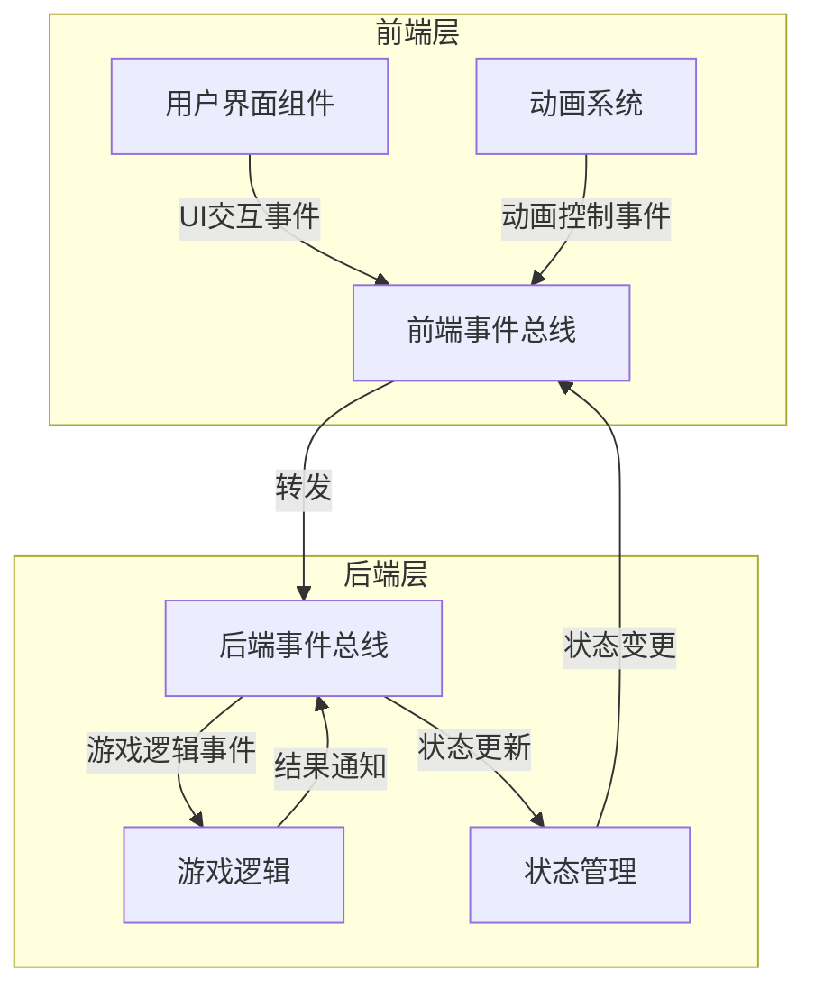
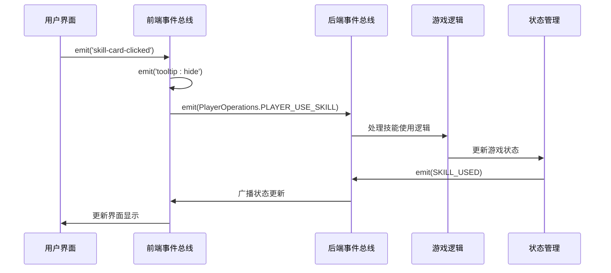
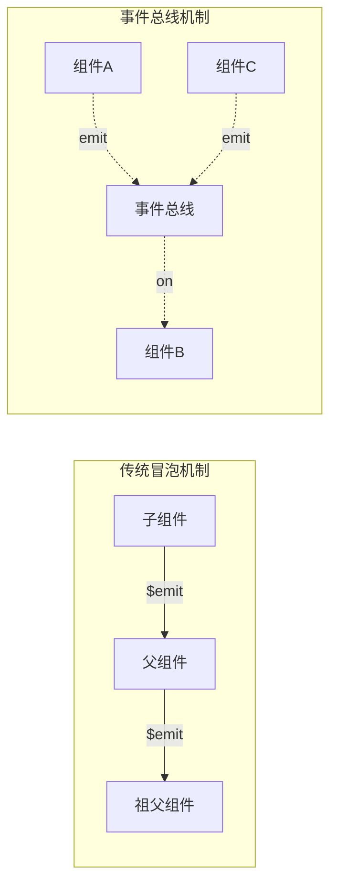
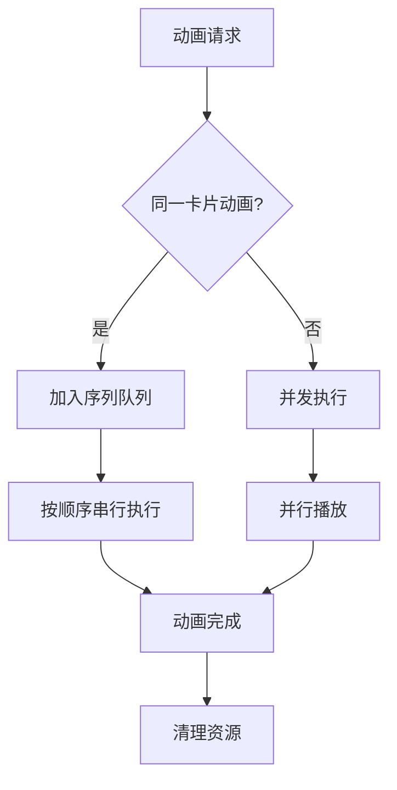

# 组件通信机制

<cite>
**本文档引用的文件**
- [frontendEventBus.js](file://src/frontendEventBus.js)
- [backendEventBus.js](file://src/backendEventBus.js)
- [SkillCard.vue](file://src/components/global/SkillCard.vue)
- [ActionPanel.vue](file://src/components/battle/ActionPanel.vue)
- [ActivatedSkillsBar.vue](file://src/components/battle/ActivatedSkillsBar.vue)
- [cardAnimationOrchestrator.js](file://src/utils/cardAnimationOrchestrator.js)
- [cardDomRegistry.js](file://src/utils/cardDomRegistry.js)
- [gameState.js](file://src/data/gameState.js)
- [battle.js](file://src/data/battle.js)
- [MessagePopupScreen.vue](file://src/components/end/MessagePopupScreen.vue)
</cite>

## 目录
1. [简介](#简介)
2. [双事件总线架构概述](#双事件总线架构概述)
3. [前端事件总线详解](#前端事件总线详解)
4. [后端事件总线详解](#后端事件总线详解)
5. [组件通信实例分析](#组件通信实例分析)
6. [事件命名规范与管理](#事件命名规范与管理)
7. [动画编排与事件总线集成](#动画编排与事件总线集成)
8. [性能考量与内存泄漏防范](#性能考量与内存泄漏防范)
9. [最佳实践与设计原则](#最佳实践与设计原则)
10. [总结](#总结)

## 简介

本项目采用了一种创新的双事件总线架构，通过前端事件总线（frontendEventBus）和后端事件总线（backendEventBus）实现了清晰的职责分离和高效的组件间通信。这种设计不仅简化了组件间的耦合关系，还为复杂的动画编排和游戏逻辑处理提供了强大的基础设施支持。

## 双事件总线架构概述

### 架构设计理念

双事件总线架构的核心思想是将事件分为两个层次：
- **前端事件总线**：负责UI交互事件和动画控制
- **后端事件总线**：负责游戏逻辑事件和状态更新



**图表来源**
- [frontendEventBus.js](file://src/frontendEventBus.js#L1-L8)
- [backendEventBus.js](file://src/backendEventBus.js#L1-L80)

### 职责分离原则

前端事件总线专注于：
- 用户交互事件（如技能点击、鼠标悬停）
- 动画控制和播放
- UI状态更新
- 视觉反馈处理

后端事件总线专注于：
- 游戏逻辑处理
- 状态验证和计算
- 数据持久化
- 业务规则执行

**章节来源**
- [frontendEventBus.js](file://src/frontendEventBus.js#L1-L8)
- [backendEventBus.js](file://src/backendEventBus.js#L1-L80)

## 前端事件总线详解

### 基础架构

前端事件总线基于mitt库实现，提供了轻量级的事件发布订阅机制：

```javascript
// 前端事件总线
// 前端事件总线负责在前端组件之间传递事件和数据，一般用于控制和播放动画，不涉及具体结算逻辑
import mitt from 'mitt';

const frontendEventBus = mitt();

export default frontendEventBus;
```

### 主要事件类型

前端事件总线处理多种类型的UI交互事件：

1. **技能卡片事件**
   - `skill-card-hover-start`：技能卡片悬停开始
   - `skill-card-hover-end`：技能卡片悬停结束
   - `card-transfer-start`：卡片转移开始
   - `card-transfer-end`：卡片转移结束

2. **工具提示事件**
   - `tooltip:show`：显示工具提示
   - `tooltip:move`：移动工具提示
   - `tooltip:hide`：隐藏工具提示

3. **动画事件**
   - `spawn-particles`：生成粒子效果
   - `card-selection-finished`：卡片选择完成

4. **对话事件**
   - `dialog-ended`：对话结束

### 实际应用示例

以SkillCard组件为例，展示了前端事件总线的具体使用：

```javascript
methods: {
  onMouseEnter() {
    this.hovered = true;
    if (!this.previewMode) frontendEventBus.emit('skill-card-hover-start', this.skill);
  },
  onMouseLeave() {
    this.hovered = false;
    if (!this.previewMode) frontendEventBus.emit('skill-card-hover-end', this.skill);
  }
}
```

**章节来源**
- [SkillCard.vue](file://src/components/global/SkillCard.vue#L150-L160)
- [frontendEventBus.js](file://src/frontendEventBus.js#L1-L8)

## 后端事件总线详解

### 事件分类体系

后端事件总线采用了分层的事件命名空间，确保了事件的组织性和可维护性：

```javascript
export const EventNames = {
  Game: {
    PRE_GAME_START: 'pre-game-start',
    GAME_START: 'game-start',
    ENTER_BATTLE_STAGE: 'enter-battle-stage',
    ENTER_REST_STAGE: 'enter-rest-stage',
    PRE_BATTLE: 'pre-battle',
    POST_BATTLE: 'post-battle',
    GAME_OVER: 'game-over',
  },
  Player: {
    TIER_UPGRADED: 'player-tier-upgraded',
    ABILITY_CLAIMED: 'player-ability-claimed',
    MONEY_CLAIMED: 'player-money-claimed',
    SKILL_REWARD_CLAIMED: 'player-skill-claimed',
    FRONTIER_UPDATED: 'player-frontier-skills-updated',
    ACTIVATED_SKILLS_UPDATED: 'player-activated-skills-updated',
    EFFECT_CHANGED: 'player-effect-changed',
    SKILL_BURNT: 'player-skill-burnt',
    SKILL_DISCOVERED: 'player-skill-discovered',
    SKILL_USED: 'player-skill-used',
    SKILL_DROPPED: 'player-skill-dropped',
    SKILL_DRAWN: 'player-skill-drawn'
  },
  PlayerOperations: {
    PLAYER_USE_SKILL: 'battle-player-use-skill',
    PLAYER_SHIFT_SKILL: 'battle-player-shift-skill',
    PLAYER_END_TURN: 'player-end-turn',
    PLAYER_STOP_ACTIVATED_SKILL: 'battle-player-stop-activated-skill',
    CLAIM_MONEY: 'rest-claim-money',
    CLAIM_SKILL: 'rest-claim-skill',
    CLAIM_ABILITY: 'rest-claim-ability',
    CLAIM_BREAKTHROUGH: 'rest-claim-breakthrough',
    REORDER_SKILLS: 'rest-reorder-skills',
    PURCHASE_ITEM: 'rest-purchase-item',
    FINISH: 'rest-finish',
    DROP_REWARD: 'rest-drop-reward'
  }
};
```

### 事件流转机制



**图表来源**
- [ActionPanel.vue](file://src/components/battle/ActionPanel.vue#L122-L127)
- [backendEventBus.js](file://src/backendEventBus.js#L33-L78)

### 游戏逻辑事件处理

后端事件总线在游戏逻辑中的典型应用：

```javascript
// 使用技能时的事件处理
function useSkill(skill) {
  // 使用技能逻辑
  addPlayerActionLog(`你使用了 /blue{${skill.name}}！`);

  // 技能脱手发动动画（卡牌移动到中央）
  enqueueAnimateCardById({id: skill.uniqueID, kind: 'flyToAnchor', options: { anchor: 'center', scale: 1.2 }}, { tags: ['ui'], waitTags: [] });
  enqueueDelay(0);
  
  // 发送技能使用事件
  backendEventBus.emit(EventNames.Player.SKILL_USED, skill.uniqueID);
}
```

**章节来源**
- [backendEventBus.js](file://src/backendEventBus.js#L33-L78)
- [battle.js](file://src/data/battle.js#L180-L190)

## 组件通信实例分析

### SkillCard到ActionPanel的通信

这是一个典型的组件间通信案例，展示了前端事件总线如何协调不同组件：

```mermaid
flowchart TD
SkillCard[SkillCard.vue] --> |emit('skill-card-clicked')| ActionPanel[ActionPanel.vue]
ActionPanel --> |emit('tooltip:hide')| FrontendBus[前端事件总线]
ActionPanel --> |emit(PlayerOperations.PLAYER_USE_SKILL)| BackendBus[后端事件总线]
BackendBus --> |处理技能使用逻辑| BattleLogic[战斗逻辑]
BattleLogic --> |更新状态| BackendBus
BackendBus --> |广播SKILL_USED| FrontendBus
FrontendBus --> |更新UI| ActionPanel
```

**图表来源**
- [SkillCard.vue](file://src/components/global/SkillCard.vue#L150-L160)
- [ActionPanel.vue](file://src/components/battle/ActionPanel.vue#L122-L127)

### ActivatedSkillsBar的事件监听

ActivatedSkillsBar组件展示了如何正确地监听和处理事件：

```javascript
mounted() {
  if (this.listenTransferEvents) {
    frontendEventBus.on('card-transfer-start', this.onTransferStart);
    frontendEventBus.on('card-transfer-end', this.onTransferEnd);
  }
},
beforeUnmount() {
  frontendEventBus.off('card-transfer-start', this.onTransferStart);
  frontendEventBus.off('card-transfer-end', this.onTransferEnd);
  Object.keys(this.cardRefs).forEach(id => unregisterCardEl(id, 'activated-skills-bar'));
}
```

### 事件参数传递

事件总线支持灵活的参数传递机制：

```javascript
// 显示工具提示的事件
onShiftTooltipEnter(e) {
  frontendEventBus.emit('tooltip:show', {
    name: '换卡',
    text: '丢弃手牌中最左侧卡，然后抽一张卡。每场战斗中，使用后开销增1。',
    x: e?.clientX ?? 0,
    y: e?.clientY ?? 0
  });
}
```

**章节来源**
- [ActivatedSkillsBar.vue](file://src/components/battle/ActivatedSkillsBar.vue#L70-L85)
- [ActionPanel.vue](file://src/components/battle/ActionPanel.vue#L144-L155)

## 事件命名规范与管理

### 命名空间策略

项目采用了严格的命名空间策略来组织事件：

1. **功能域命名空间**
   - `tooltip:`：工具提示相关事件
   - `card-tooltip:`：卡片工具提示事件
   - `dialog-ended`：对话结束事件

2. **语义化事件名称**
   - 使用动词+名词的形式
   - 描述事件的动作和影响对象
   - 如：`PLAYER_USE_SKILL`、`SKILL_USED`

3. **事件生命周期标识**
   - `start`：事件开始
   - `end`：事件结束
   - `update`：状态更新

### 事件监听器管理

正确的事件监听器生命周期管理至关重要：

```javascript
// 正确的监听器管理模式
mounted() {
  frontendEventBus.on('pop-message', this.handleMessage);
},
beforeUnmount() {
  frontendEventBus.off('pop-message', this.handleMessage);
}
```

### 事件冒泡替代方案

由于Vue组件的事件冒泡机制，项目采用了事件总线作为替代方案：



**章节来源**
- [MessagePopupScreen.vue](file://src/components/end/MessagePopupScreen.vue#L20-L30)
- [cardAnimationOrchestrator.js](file://src/utils/cardAnimationOrchestrator.js#L10-L30)

## 动画编排与事件总线集成

### 卡牌动画编排系统

项目实现了一个复杂的卡牌动画编排系统，与事件总线深度集成：

```javascript
// 卡牌转移事件机制
{
  id: <number|string>,            // 卡牌唯一ID
  kind: <string>,                 // 动画种类（appearFromAnchor / centerThenDeck / flyToDeckFade / exhaust ...）
  type: <string>,                 // 语义化转移类型（如 'appear' / 'move' / 'focus' / 'exhaust' 等）
  from: <string|undefined>,       // 来源容器标识（可选）
  to: <string|undefined>,         // 目标容器标识（可选）
  token: <string>,                // 唯一标记（如果调用方未提供将自动生成）
  phase: 'start' | 'end'          // 事件阶段
}
```

### 动画队列管理



**图表来源**
- [cardAnimationOrchestrator.js](file://src/utils/cardAnimationOrchestrator.js#L10-L30)

### 容器组件事件处理

容器组件通过监听`card-transfer-end`事件来处理动画完成后的状态更新：

```javascript
// 容器组件应监听 card-transfer-end，匹配自身 containerKey === payload.to 后再执行显示/状态更新
frontendEventBus.on('card-transfer-end', this.onTransferEnd);

onTransferEnd(payload = {}) {
  if (payload.phase !== 'end') return;
  const { id, to, from } = payload;
  if (to === this.containerKey && this.appearing[id]) {
    delete this.appearing[id];
  }
  if (from === this.containerKey && this.leaving[id]) {
    delete this.leaving[id];
  }
}
```

**章节来源**
- [cardAnimationOrchestrator.js](file://src/utils/cardAnimationOrchestrator.js#L10-L30)
- [ActivatedSkillsBar.vue](file://src/components/battle/ActivatedSkillsBar.vue#L85-L95)

## 性能考量与内存泄漏防范

### 内存泄漏防范措施

1. **及时清理事件监听器**
```javascript
beforeUnmount() {
  frontendEventBus.off('disable-controls');
  frontendEventBus.off('enable-controls');
  Object.keys(this.cardRefs).forEach(id => unregisterCardEl(id, 'activated-skills-bar'));
}
```

2. **弱引用管理**
```javascript
// 使用Map而非普通对象来存储引用，便于垃圾回收
const registry = new Map();
```

3. **事件监听器去重**
```javascript
setCardRef(el, id) {
  if (el) {
    if(this.cardRefs[id] === el) return ; // no change
    this.cardRefs[id] = el;
    const dom = el.$el ? el.$el : el;
    registerCardEl(id, dom, 'activated-skills-bar');
  } else {
    unregisterCardEl(id, 'activated-skills-bar');
    delete this.cardRefs[id];
  }
}
```

### 性能优化策略

1. **异步动画队列**
   - 同一卡片的动画指令按顺序串行执行
   - 不同卡片的动画可并发播放

2. **事件节流**
   - 避免频繁的事件发射
   - 使用适当的延迟机制

3. **DOM元素缓存**
   - 缓存卡片DOM元素引用
   - 减少DOM查询开销

### 监控和调试

```javascript
// 调试友好的事件处理
mounted() {
  frontendEventBus.on('disable-controls', () => {
    console.log('ActionPanel: disable-controls received');
    this.isControlDisabled = true;
  });
}
```

**章节来源**
- [ActivatedSkillsBar.vue](file://src/components/battle/ActivatedSkillsBar.vue#L70-L85)
- [cardDomRegistry.js](file://src/utils/cardDomRegistry.js#L1-L30)

## 最佳实践与设计原则

### 设计原则

1. **单一职责原则**
   - 前端事件总线只负责UI交互和动画
   - 后端事件总线只负责游戏逻辑和状态

2. **松耦合设计**
   - 组件间通过事件总线通信
   - 避免直接的父子组件依赖

3. **事件生命周期管理**
   - 在组件销毁时清理事件监听器
   - 避免内存泄漏

### 代码组织最佳实践

1. **事件常量定义**
```javascript
// 在backendEventBus.js中集中定义事件名称
export const EventNames = {
  Player: {
    SKILL_USED: 'player-skill-used',
    SKILL_DROPPED: 'player-skill-dropped'
  }
};
```

2. **统一的事件处理模式**
```javascript
// 统一的事件监听和处理模式
mounted() {
  frontendEventBus.on('some-event', this.handleSomeEvent);
},
beforeUnmount() {
  frontendEventBus.off('some-event', this.handleSomeEvent);
}
```

3. **错误处理**
```javascript
// 带错误处理的事件发射
try {
  frontendEventBus.emit('some-event', data);
} catch (error) {
  console.error('Failed to emit event:', error);
}
```

### 测试策略

1. **单元测试事件总线**
```javascript
// 测试事件发射和监听
test('should emit and handle events', () => {
  const callback = jest.fn();
  frontendEventBus.on('test-event', callback);
  frontendEventBus.emit('test-event', { data: 'test' });
  expect(callback).toHaveBeenCalledWith({ data: 'test' });
});
```

2. **集成测试组件通信**
```javascript
// 测试组件间通过事件总线的通信
test('SkillCard should emit events on interaction', async () => {
  const wrapper = mount(SkillCard, { props: { skill: testSkill } });
  await wrapper.find('.skill-card').trigger('click');
  expect(frontendEventBus.emit).toHaveBeenCalledWith('skill-card-clicked', testSkill);
});
```

## 总结

本项目的双事件总线架构展现了现代前端应用中组件通信的最佳实践。通过清晰的职责分离、严格的命名规范和完善的生命周期管理，实现了高效、可维护的组件间通信机制。

### 核心优势

1. **清晰的架构分离**：前端和后端事件总线各司其职，避免了逻辑混乱
2. **高度解耦**：组件间通过事件总线通信，降低了耦合度
3. **强大的动画支持**：与动画编排系统无缝集成
4. **良好的可维护性**：事件命名规范和生命周期管理确保了代码质量

### 应用价值

这种设计模式特别适用于：
- 复杂的游戏界面开发
- 需要精细动画控制的应用
- 多层级组件通信场景
- 需要严格状态管理的系统

通过深入理解和应用这些设计原则，开发者可以构建出更加健壮、可扩展的前端应用程序。