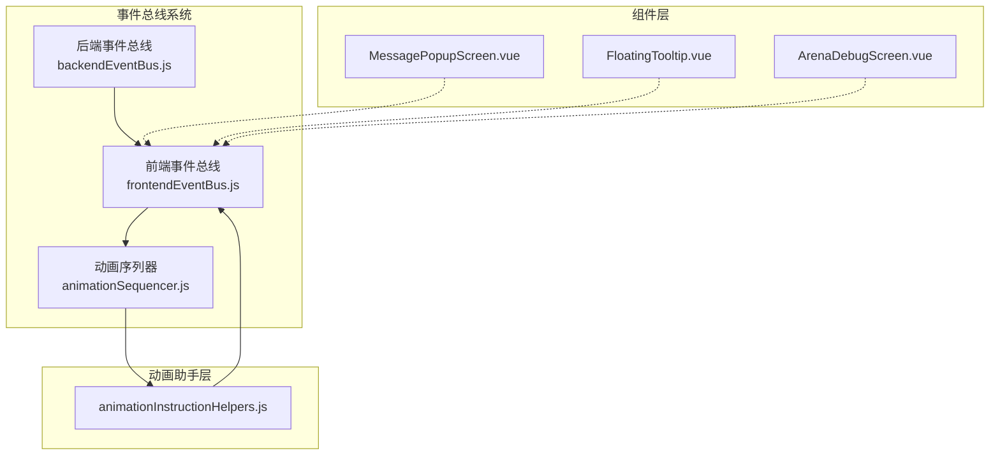
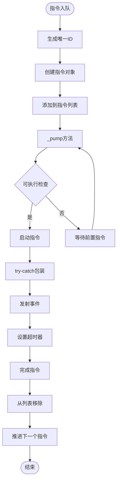

# 事件总线系统错误处理与性能优化策略

<cite>
**本文档引用的文件**
- [frontendEventBus.js](file://src/frontendEventBus.js)
- [backendEventBus.js](file://src/backendEventBus.js)
- [animationSequencer.js](file://src/data/animationSequencer.js)
- [animationInstructionHelpers.js](file://src/data/animationInstructionHelpers.js)
- [MessagePopupScreen.vue](file://src/components/end/MessagePopupScreen.vue)
- [FloatingTooltip.vue](file://src/components/global/FloatingTooltip.vue)
- [ArenaDebugScreen.vue](file://src/components/global/ArenaDebugScreen.vue)
</cite>

## 目录
1. [简介](#简介)
2. [事件总线架构概览](#事件总线架构概览)
3. [错误处理机制](#错误处理机制)
4. [性能优化策略](#性能优化策略)
5. [内存泄漏防护](#内存泄漏防护)
6. [高频事件处理](#高频事件处理)
7. [事件监控与调试](#事件监控与调试)
8. [最佳实践建议](#最佳实践建议)
9. [总结](#总结)

## 简介

本文档深入分析了RTVL游戏项目中事件总线系统的错误处理机制和性能优化策略。该系统采用分层架构设计，包括前端事件总线、后端事件总线和动画序列器三个核心组件，通过try-catch包装、事件监听器管理、内存泄漏防护等技术手段确保系统的稳定性和性能。

## 事件总线架构概览



**图表来源**
- [frontendEventBus.js](file://src/frontendEventBus.js#L1-L8)
- [backendEventBus.js](file://src/backendEventBus.js#L1-L79)
- [animationSequencer.js](file://src/data/animationSequencer.js#L1-L134)

**章节来源**
- [frontendEventBus.js](file://src/frontendEventBus.js#L1-L8)
- [backendEventBus.js](file://src/backendEventBus.js#L1-L79)
- [animationSequencer.js](file://src/data/animationSequencer.js#L1-L134)

## 错误处理机制

### Try-Catch包装机制

事件总线系统的核心错误处理策略是通过try-catch包装emit调用，确保单个监听器异常不会中断整个事件广播流程。

#### 动画序列器中的错误处理

```javascript
_startInstruction(instr) {
  instr.status = 'running';
  instr._startedAt = Date.now();
  try {
    instr.start({ id: instr.id, meta: instr.meta, emit: (name, payload) => frontendEventBus.emit(name, payload) });
  } catch (err) {
    console.error('[animationSequencer] start logic error:', err);
  }
  if (isFinite(instr.durationMs) && instr.durationMs >= 0) {
    const timerId = setTimeout(() => {
      this.finish(instr.id, 'timeout');
    }, Math.max(0, instr.durationMs));
    this._idToTimer.set(instr.id, timerId);
  }
}
```

#### 动画指令助手中的错误处理

在多个动画指令中，系统采用了统一的try-catch模式：

```javascript
// 通用事件指令
start: ({ emit }) => { try { emit(eventName, payload); } catch (_) {} },

// 粒子效果
start: ({ emit }) => { try { emit('spawn-particles', particles); } catch (_) {} },

// 音效播放
start: ({ emit }) => { try { emit('play-sound', payload); } catch (_) {} },

// 消息弹窗
start: ({ emit }) => { try { emit('pop-message', payload); } catch (_) {} },

// 战斗日志
start: ({ emit }) => { try { emit('add-battle-log', payload); } catch (_) {} }
```

### 错误事件捕获与用户提示

MessagePopupScreen组件展示了错误事件的捕获与用户提示机制：

```javascript
mounted() {
  // 监听pop-message事件
  frontendEventBus.on('pop-message', (message) => {
    this.addMessage(message);
  });
},
beforeUnmount() {
  // 移除事件监听
  frontendEventBus.off('pop-message');
},
```

该组件实现了完整的错误消息生命周期管理：
- **消息接收**：监听pop-message事件
- **消息存储**：维护消息队列
- **自动移除**：设置定时器自动清理
- **组件销毁**：在组件卸载时清理事件监听器

**章节来源**
- [animationSequencer.js](file://src/data/animationSequencer.js#L101-L133)
- [animationInstructionHelpers.js](file://src/data/animationInstructionHelpers.js#L295-L367)
- [MessagePopupScreen.vue](file://src/components/end/MessagePopupScreen.vue#L25-L40)

## 性能优化策略

### 指令队列管理系统

动画序列器采用先进的指令队列管理系统，通过标签系统实现复杂的依赖关系处理：



**图表来源**
- [animationSequencer.js](file://src/data/animationSequencer.js#L40-L133)

### 标签系统与依赖管理

系统使用标签系统实现智能的依赖管理：

```javascript
// 指令标签配置
tags: new Set([...(tags || []), 'all']),  // 所有指令都拥有 all 标签
waitTags: new Set(waitTags === undefined ? ['all'] : (waitTags || [])), // 等待标签配置

// 可执行判定逻辑
_canExecute(index) {
  const current = this._instructions[index];
  if (!current) return false;
  for (let j = 0; j < index; j++) {
    const prev = this._instructions[j];
    if (!prev) continue;
    if (prev.status === 'finished') continue;
    if (hasIntersection(prev.tags, current.waitTags)) {
      return false;
    }
  }
  return true;
}
```

### 状态同步优化

系统实现了智能的状态同步机制，避免不必要的状态更新：

```javascript
// 状态同步调度
let backendStateDirty = false;
let endOfTickStateSycnScheduled = false;

function scheduleEndOfTickCheck() {
  if (endOfTickStateSycnScheduled) return;
  endOfTickStateSycnScheduled = true;
  setTimeout(() => {
    endOfTickStateSycnScheduled = false;
    if (backendStateDirty) {
      // tick 结束仍有未同步的变更，强制入队一次当前快照（默认带屏障）
      enqueueState();
    }
  }, 0);
}
```

**章节来源**
- [animationSequencer.js](file://src/data/animationSequencer.js#L40-L133)
- [animationInstructionHelpers.js](file://src/data/animationInstructionHelpers.js#L200-L250)

## 内存泄漏防护

### Vue组件生命周期管理

系统在Vue组件中实现了完整的事件监听器生命周期管理：

```javascript
// MessagePopupScreen.vue
export default {
  name: 'MessagePopupScreen',
  mounted() {
    // 注册事件监听器
    frontendEventBus.on('pop-message', (message) => {
      this.addMessage(message);
    });
  },
  beforeUnmount() {
    // 清理事件监听器
    frontendEventBus.off('pop-message');
  }
}
```

### 动态事件处理器清理

在复杂的动画指令中，系统实现了动态事件处理器的自动清理：

```javascript
// 对话框指令中的事件清理
start: ({ id, emit }) => {
  const handler = () => {
    frontendEventBus.off('dialog-ended', handler);
    frontendEventBus.emit('animation-instruction-finished', { id });
  };
  frontendEventBus.on('dialog-ended', handler);
  try { 
    emit('display-dialog', dialogItems); 
  } catch (_) { 
    frontendEventBus.off('dialog-ended', handler); 
  }
}
```

### 弱引用和定时器管理

系统通过Map结构管理定时器，确保资源正确释放：

```javascript
// 定时器映射管理
this._idToTimer = new Map();

// 定时器清理
finish(id, reason = 'manual') {
  const instr = this._instructions.find(i => i.id === id);
  if (!instr) return false;
  
  // 清理超时器
  const t = this._idToTimer.get(id);
  if (t) {
    clearTimeout(t);
    this._idToTimer.delete(id);
  }
  
  // 释放已完成的指令节点
  this._instructions = this._instructions.filter(i => i.status !== 'finished');
}
```

**章节来源**
- [MessagePopupScreen.vue](file://src/components/end/MessagePopupScreen.vue#L25-L40)
- [animationInstructionHelpers.js](file://src/data/animationInstructionHelpers.js#L364-L390)
- [animationSequencer.js](file://src/data/animationSequencer.js#L63-L85)

## 高频事件处理

### 节流策略实现

虽然当前代码中没有显式的节流函数，但系统通过以下方式实现了类似的效果：

1. **指令队列限制**：通过标签系统避免并发冲突
2. **状态同步批处理**：使用setTimeout(0)实现微任务批处理
3. **事件去重**：通过唯一ID系统避免重复处理

### 事件批处理优化

系统实现了智能的事件批处理机制：

```javascript
// 状态变更批处理
export function registerBackendStateWatcher() {
  watch(backendGameState, () => {
    backendStateDirty = true;
    scheduleEndOfTickCheck();
  }, {deep: true, flush: "sync"});
}

// 批处理调度
function scheduleEndOfTickCheck() {
  if (endOfTickStateSycnScheduled) return;
  endOfTickStateSycnScheduled = true;
  setTimeout(() => {
    endOfTickStateSycnScheduled = false;
    if (backendStateDirty) {
      enqueueState();
    }
  }, 0);
}
```

### 大型项目事件监控集成

对于大型项目，建议集成以下事件监控工具：

1. **性能监控**：使用Performance API监控事件处理时间
2. **内存监控**：定期检查事件监听器数量
3. **错误追踪**：集成Sentry等错误监控服务
4. **事件追踪**：记录关键事件的处理路径

**章节来源**
- [animationInstructionHelpers.js](file://src/data/animationInstructionHelpers.js#L220-L250)

## 事件监控与调试

### 调试屏幕集成

系统提供了专门的调试界面：

```javascript
// ArenaDebugScreen.vue
export default {
  name: 'ArenaDebugScreen'
};
```

### 控制台错误输出

系统在关键位置提供了详细的错误输出：

```javascript
// 动画序列器错误处理
catch (err) {
  console.error('[animationSequencer] start logic error:', err);
}

// 状态投影错误处理
catch (err) {
  console.error('[animationInstructionHelpers] applyProjectionToDisplay failed:', err);
}
```

### 事件追踪机制

系统通过以下方式实现事件追踪：

1. **指令ID追踪**：每个指令都有唯一ID
2. **状态变化追踪**：监控指令状态转换
3. **事件发射追踪**：记录事件发射过程
4. **超时处理追踪**：监控超时情况

**章节来源**
- [ArenaDebugScreen.vue](file://src/components/global/ArenaDebugScreen.vue#L1-L15)
- [animationSequencer.js](file://src/data/animationSequencer.js#L101-L110)
- [animationInstructionHelpers.js](file://src/data/animationInstructionHelpers.js#L220-L230)

## 最佳实践建议

### 1. 错误处理最佳实践

- **始终使用try-catch包装emit调用**
- **提供详细的错误日志信息**
- **实现优雅降级机制**
- **监控错误率并设置告警**

### 2. 性能优化最佳实践

- **合理使用标签系统管理依赖**
- **避免在高频事件中执行复杂计算**
- **及时清理不再需要的事件监听器**
- **使用setTimeout(0)实现微任务批处理**

### 3. 内存管理最佳实践

- **在组件销毁时清理所有事件监听器**
- **使用弱引用避免循环引用**
- **定期检查内存使用情况**
- **实现事件监听器数量监控**

### 4. 调试和监控最佳实践

- **集成专业的错误监控服务**
- **实现事件追踪和性能监控**
- **提供详细的日志记录**
- **建立完善的测试覆盖**

## 总结

RTVL项目的事件总线系统展现了优秀的错误处理和性能优化策略。通过try-catch包装、标签系统管理、内存泄漏防护等技术手段，系统能够在保证功能完整性的同时维持高性能。主要特点包括：

1. **健壮的错误处理**：通过多层次的try-catch包装确保系统稳定性
2. **智能的依赖管理**：基于标签系统的指令队列管理
3. **完善的内存管理**：Vue组件生命周期配合事件监听器清理
4. **高效的性能优化**：批处理、微任务调度等优化策略
5. **全面的监控支持**：详细的错误日志和调试界面

这些设计原则和实现策略为构建大规模、高性能的事件驱动系统提供了宝贵的参考价值。