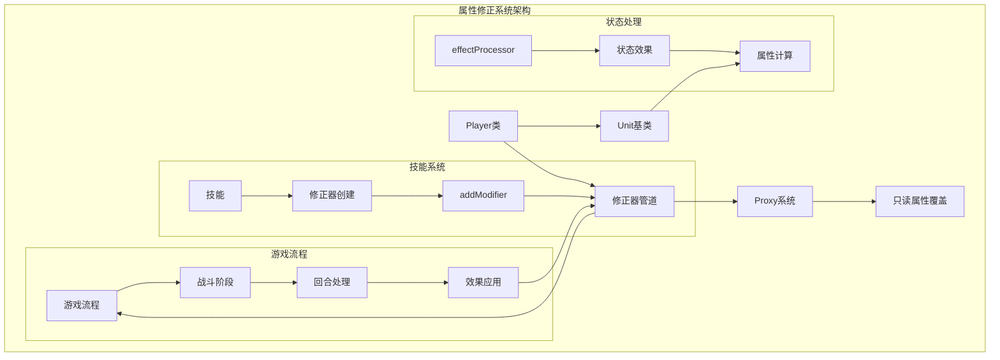
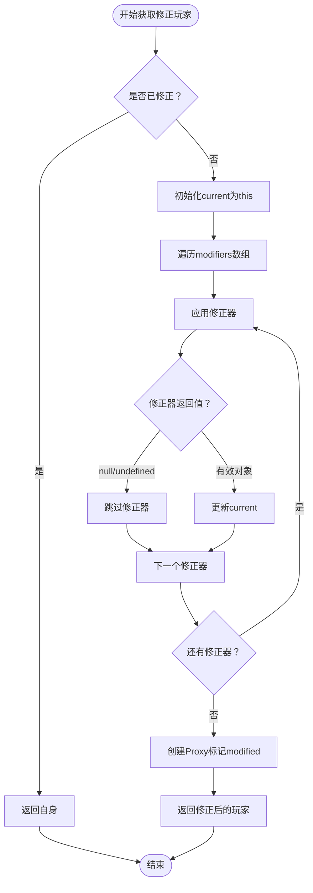

# 属性修正系统

<cite>
**本文档中引用的文件**
- [player.js](file://src/data/player.js)
- [unit.js](file://src/data/unit.js)
- [effectProcessor.js](file://src/data/effectProcessor.js)
- [basic.js](file://src/data/skills/deprecated/basic.js)
- [matialArts.js](file://src/data/skills/deprecated/matialArts.js)
- [martialArtPose.js](file://src/data/skills/martial_arts/martialArtPose.js)
- [agilePunch.js](file://src/data/skills/martial_arts/agilePunch.js)
- [game.js](file://src/game.js)
- [testSkill.js](file://src/data/testSkill.js)
</cite>

## 目录
1. [简介](#简介)
2. [系统架构概览](#系统架构概览)
3. [核心组件分析](#核心组件分析)
4. [属性修正器管线详解](#属性修正器管线详解)
5. [状态处理与效果系统](#状态处理与效果系统)
6. [实际应用案例](#实际应用案例)
7. [性能优化策略](#性能优化策略)
8. [开发指南](#开发指南)
9. [故障排除](#故障排除)
10. [总结](#总结)

## 简介

属性修正系统是Wekyspire游戏的核心机制之一，它通过管道式的设计实现了灵活的角色属性动态调整。该系统基于JavaScript的Proxy对象技术，提供了强大的属性覆盖和计算能力，同时支持状态效果的实时响应。

系统的主要特点包括：
- **管道化修正器管理**：通过modifiers数组有序执行多个修正器
- **动态属性覆盖**：利用Proxy实现只读属性的透明覆盖
- **状态效果集成**：与effectProcessor紧密配合，实现复杂的游戏逻辑
- **性能优化**：通过modified标记避免重复计算
- **错误容错**：完善的异常处理机制确保系统稳定性

## 系统架构概览



**图表来源**
- [player.js](file://src/data/player.js#L117-L226)
- [unit.js](file://src/data/unit.js#L1-L143)
- [effectProcessor.js](file://src/data/effectProcessor.js#L1-L357)

## 核心组件分析

### Player类设计

Player类继承自Unit类，扩展了属性修正系统的完整功能：

```javascript
export class Player extends Unit {
  constructor() {
    super();
    // ... 其他属性初始化
    this.modifiers = [];  // 修正器管线
    this.modified = false; // 性能优化标记
  }
  
  // 属性修正系统 API
  addModifier(modifierFn) { /* ... */ }
  removeModifier(modifierFn) { /* ... */ }
  getModifiedPlayer() { /* ... */ }
}
```

### Unit基类属性计算

Unit类定义了基础的属性计算逻辑，为修正系统提供计算模板：

```javascript
get attack() {
  return this.baseAttack + (this.effects['力量'] || 0);
}

get defense() {
  return this.baseDefense + (this.effects['坚固'] || 0);
}

get magic() {
  return this.baseMagic + (this.effects['集中'] || 0);
}
```

**章节来源**
- [player.js](file://src/data/player.js#L117-L226)
- [unit.js](file://src/data/unit.js#L15-L30)

## 属性修正器管线详解

### addModifier方法

`addModifier`方法负责向修正器管道中添加新的修正器函数：

```javascript
addModifier(modifierFn) {
  if (typeof modifierFn === 'function') this.modifiers.push(modifierFn);
  else console.warn('尝试添加非法的属性修正器：', modifierFn, '应为 function(player)=>player');
}
```

该方法具有以下特性：
- **类型检查**：确保只接受函数类型的修正器
- **警告机制**：对非法输入发出警告但不中断程序
- **简单直接**：将修正器函数直接添加到modifiers数组末尾

### removeModifier方法

`removeModifier`方法实现修正器的移除功能：

```javascript
removeModifier(modifierFn) {
  this.modifiers = this.modifiers.filter(m => m !== modifierFn);
}
```

移除机制的特点：
- **精确匹配**：基于严格相等比较移除特定修正器
- **数组过滤**：创建新的数组副本，保持原始数组不变
- **即时生效**：立即从管道中移除，不影响当前修正结果

### getModifiedPlayer方法

`getModifiedPlayer`方法是整个修正系统的核心，负责顺序应用所有修正器：



**图表来源**
- [player.js](file://src/data/player.js#L163-L195)

修正器应用过程的关键步骤：

1. **性能优化检查**：如果已经标记为modified，直接返回自身
2. **顺序应用**：按modifiers数组顺序依次应用每个修正器
3. **异常处理**：捕获修正器执行中的异常，避免影响后续修正
4. **空值处理**：允许修正器返回null/undefined以跳过修正
5. **最终标记**：为修正后的对象添加modified标记

**章节来源**
- [player.js](file://src/data/player.js#L145-L195)

## 状态处理与效果系统

### effectProcessor.js集成

effectProcessor.js提供了完整的状态效果处理逻辑，与属性修正系统深度集成：

```javascript
export function processStartOfTurnEffects(target) {
  // 处理各种状态效果
  if(target.effects['敏捷'] > 0) {
    target.addEffect('敏捷', -1);
  }
  
  if(target.effects['滞气'] > 0) {
    target.addEffect('滞气', -1);
  }
  
  // 其他效果处理...
}
```

### 敏捷效果的影响

敏捷效果直接影响玩家的agility属性：

```javascript
get agility() {
  return (this.effects['敏捷'] || 0);
}
```

当存在敏捷效果时，玩家可以获得额外的行动点或其他增益效果。

### 滞气效果的限制

滞气效果通过maxDrawSkillCardCount属性限制玩家抽牌：

```javascript
get maxDrawSkillCardCount() {
  return (this.effects['滞气'] || 0) > 0 ? 0 : Infinity;
}
```

当滞气效果存在时，玩家无法抽牌，这直接影响了技能使用策略。

**章节来源**
- [effectProcessor.js](file://src/data/effectProcessor.js#L1-L200)
- [player.js](file://src/data/player.js#L135-L142)

## 实际应用案例

### 基础属性修正器

最简单的属性修正器示例：

```javascript
// 创建一个增加攻击力的修正器
const attackBoost = createPlayerStatModifier({
  attack: (baseValue, player) => baseValue + 5
});

// 应用修正器
player.addModifier(attackBoost);
```

### 复杂条件修正器

基于状态条件的动态修正器：

```javascript
const conditionalModifier = (player) => {
  return new Proxy(player, {
    get(target, prop, receiver) {
      if (prop === 'attack') {
        const base = Reflect.get(target, 'attack', receiver);
        // 仅在特定状态下生效
        if (target.effects['力量'] > 0) {
          return base + target.effects['力量'];
        }
        return base;
      }
      return Reflect.get(target, prop, receiver);
    }
  });
};
```

### 技能集成示例

以martialArtPose技能为例，展示修正器的实际应用：

```javascript
onEnable(player) {
  super.onEnable(player);
  
  // 事件监听器修正器
  this.listener_ = ({effectName, deltaStacks}) => {
    if(effectName === '格挡' && deltaStacks > 0) {
      const player = backendGameState.player.getModifiedPlayer();
      player.addEffect('力量', this.powerUpMultiplier);
    }
  };
  
  // 属性修正器
  this.modifier_ = (player) => {
    const self = this;
    return new Proxy(player, {
      get(target, prop, receiver) {
        if (prop === 'attack') {
          return target.attack + (target.effects['格挡'] || 0) * self.multiplier;
        }
        return target[prop];
      }
    });
  };
  
  player.addModifier(this.modifier_);
}
```

**章节来源**
- [player.js](file://src/data/player.js#L48-L75)
- [martialArtPose.js](file://src/data/skills/martial_arts/martialArtPose.js#L78-L121)

## 性能优化策略

### modified标记优化

系统通过modified标记避免重复计算：

```javascript
getModifiedPlayer() {
  if(this.modified) return this; // 已经是修正过的，直接返回自己
  // ... 执行修正逻辑
}
```

这种设计的优势：
- **缓存机制**：避免重复应用相同的修正器
- **性能提升**：减少不必要的Proxy创建和属性访问
- **内存优化**：防止创建过多的中间对象

### 错误容错机制

修正器执行中的异常处理：

```javascript
try {
  const next = mod(current);
  if (next) current = next;
} catch (e) {
  console.warn('应用属性修正器时发生错误，已跳过：', e);
}
```

错误处理策略：
- **异常捕获**：确保单个修正器的错误不会影响其他修正器
- **日志记录**：记录错误信息便于调试
- **优雅降级**：跳过出错的修正器，保持系统正常运行

### Proxy使用优化

Proxy对象的高效使用：

```javascript
return new Proxy(player, {
  get(target, prop, receiver) {
    // 仅覆盖需要修改的只读属性
    if (prop === 'attack') {
      const base = Reflect.get(target, 'attack', receiver);
      return typeof attack === 'function' ? attack(base, receiver) : base;
    }
    // 其他属性透传
    return Reflect.get(target, prop, receiver);
  }
});
```

优化技巧：
- **选择性覆盖**：只覆盖需要修改的属性
- **Reflect使用**：保持原始getter行为
- **性能考虑**：避免不必要的属性检查

## 开发指南

### 自定义修正器开发

开发自定义修正器的基本模式：

```javascript
// 1. 创建修正器工厂函数
export function createCustomModifier(config) {
  return function(player) {
    return new Proxy(player, {
      get(target, prop, receiver) {
        switch(prop) {
          case 'attack':
            return target.attack + config.attackBonus;
          case 'defense':
            return target.defense + config.defenseBonus;
          case 'magic':
            return target.magic + config.magicBonus;
          default:
            return Reflect.get(target, prop, receiver);
        }
      }
    });
  };
}

// 2. 使用修正器
const myModifier = createCustomModifier({ attackBonus: 10, defenseBonus: 5 });
player.addModifier(myModifier);
```

### 修正器组合模式

实现多个修正器的组合：

```javascript
export function combineModifiers(...modifiers) {
  return function(player) {
    return modifiers.reduce((current, modifier) => {
      try {
        const result = modifier(current);
        return result || current;
      } catch (e) {
        console.warn('修正器组合错误：', e);
        return current;
      }
    }, player);
  };
}
```

### 生命周期管理

正确的修正器生命周期管理：

```javascript
class ModifierManager {
  constructor() {
    this.activeModifiers = new Set();
  }
  
  addModifier(modifier) {
    player.addModifier(modifier);
    this.activeModifiers.add(modifier);
  }
  
  removeModifier(modifier) {
    player.removeModifier(modifier);
    this.activeModifiers.delete(modifier);
  }
  
  removeAllModifiers() {
    this.activeModifiers.forEach(modifier => {
      player.removeModifier(modifier);
    });
    this.activeModifiers.clear();
  }
}
```

### 最佳实践

1. **保持修正器纯函数**：避免副作用，确保可预测性
2. **合理使用Proxy**：只在必要时创建Proxy对象
3. **错误处理**：为每个修正器添加适当的错误处理
4. **性能监控**：定期检查修正器的性能影响
5. **单元测试**：为每个修正器编写完整的测试用例

## 故障排除

### 常见问题及解决方案

#### 1. 修正器未生效

**症状**：添加修正器后属性没有变化

**可能原因**：
- 修正器函数不是有效的函数
- 修正器被其他修正器覆盖
- 修正器返回null/undefined

**解决方案**：
```javascript
// 检查修正器类型
console.log(typeof modifierFn); // 应该是 'function'

// 确保修正器返回有效对象
const safeModifier = (player) => {
  const result = originalModifier(player);
  return result || player; // 确保返回有效对象
};
```

#### 2. 性能问题

**症状**：游戏运行缓慢，特别是战斗阶段

**可能原因**：
- 修正器数量过多
- 修正器逻辑复杂
- 缺少modified标记优化

**解决方案**：
```javascript
// 优化修正器逻辑
const optimizedModifier = (player) => {
  // 避免重复计算
  const cachedValue = getCachedValue(player);
  return new Proxy(player, {
    get(target, prop) {
      if (prop === 'attack' && cachedValue) {
        return cachedValue;
      }
      return Reflect.get(target, prop);
    }
  });
};
```

#### 3. 内存泄漏

**症状**：长时间游戏后内存占用持续增长

**可能原因**：
- 修正器未正确移除
- 事件监听器未清理
- Proxy对象未释放

**解决方案**：
```javascript
// 正确清理资源
class SafeModifier {
  constructor() {
    this.cleanupTasks = [];
  }
  
  enable(player) {
    const modifier = this.createModifier();
    player.addModifier(modifier);
    
    // 注册清理任务
    this.cleanupTasks.push(() => {
      player.removeModifier(modifier);
    });
  }
  
  disable() {
    this.cleanupTasks.forEach(task => task());
    this.cleanupTasks = [];
  }
}
```

### 调试技巧

#### 1. 修正器链追踪

```javascript
// 添加修正器追踪
const trackedModifier = (fn) => {
  return (player) => {
    console.log('应用修正器：', fn.name || '匿名');
    const result = fn(player);
    console.log('修正结果：', result);
    return result;
  };
};
```

#### 2. 属性变化监控

```javascript
// 监控属性变化
const monitoredPlayer = new Proxy(player, {
  get(target, prop) {
    const value = Reflect.get(target, prop);
    console.log(`属性 ${prop} 被访问，值：`, value);
    return value;
  }
});
```

**章节来源**
- [player.js](file://src/data/player.js#L145-L195)

## 总结

属性修正系统是Wekyspire游戏引擎的核心组件，它通过巧妙的设计实现了灵活且高效的属性动态调整机制。系统的主要优势包括：

### 技术优势

1. **管道化设计**：通过modifiers数组实现修正器的有序执行
2. **Proxy技术**：利用JavaScript Proxy实现透明的属性覆盖
3. **状态集成**：与effectProcessor无缝集成，支持复杂的状态效果
4. **性能优化**：通过modified标记和错误处理确保系统稳定高效
5. **扩展性强**：支持自定义修正器和复杂的业务逻辑

### 设计理念

- **简洁性**：API设计直观易懂，易于学习和使用
- **灵活性**：支持多种修正器类型和组合方式
- **可靠性**：完善的错误处理和性能优化机制
- **可维护性**：清晰的代码结构和良好的文档支持

### 应用价值

属性修正系统不仅支撑了游戏的核心玩法，还为开发者提供了强大而灵活的工具。通过合理的使用和优化，可以实现复杂的游戏逻辑，同时保持良好的性能表现。

对于游戏开发者而言，掌握这个系统的设计原理和使用方法，将有助于构建更加丰富和有趣的游戏体验。无论是简单的属性加成，还是复杂的条件判断，都可以通过这个系统优雅地实现。