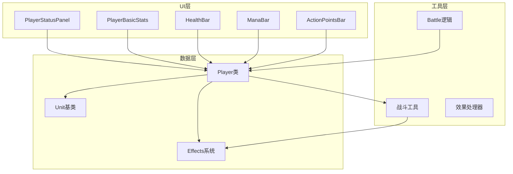
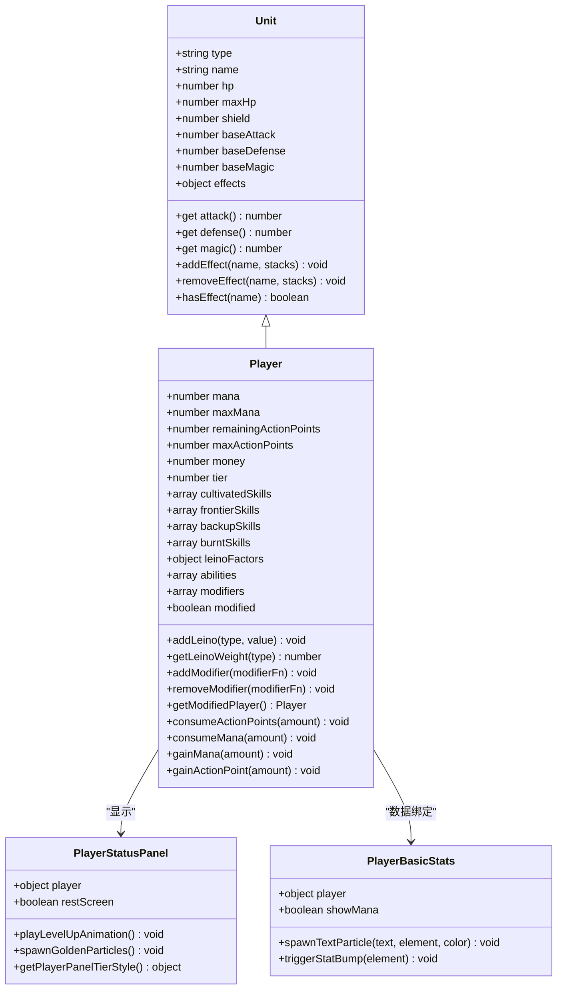

# 玩家属性系统

<cite>
**本文档中引用的文件**
- [src/data/player.js](file://src/data/player.js)
- [src/components/PlayerStatusPanel.vue](file://src/components/PlayerStatusPanel.vue)
- [src/components/PlayerBasicStats.vue](file://src/components/PlayerBasicStats.vue)
- [src/data/unit.js](file://src/data/unit.js)
- [src/data/effectProcessor.js](file://src/data/effectProcessor.js)
- [src/data/battleUtils.js](file://src/data/battleUtils.js)
- [src/data/battle.js](file://src/data/battle.js)
</cite>

## 目录
1. [简介](#简介)
2. [项目结构概览](#项目结构概览)
3. [核心属性设计](#核心属性设计)
4. [架构概览](#架构概览)
5. [详细组件分析](#详细组件分析)
6. [属性动态变化机制](#属性动态变化机制)
7. [UI数据绑定](#ui数据绑定)
8. [Effects系统集成](#effects系统集成)
9. [性能考虑](#性能考虑)
10. [故障排除指南](#故障排除指南)
11. [结论](#结论)

## 简介

玩家属性系统是游戏《WeKyspire》的核心组件之一，负责管理玩家在战斗中的各种基础属性，包括生命值、护盾、法力值、行动点等关键参数。该系统采用面向对象的设计模式，结合Vue.js的响应式特性，实现了属性的实时更新和动态变化。

系统的主要特点包括：
- 基于Unit类的属性继承机制
- 支持属性修正器的灵活扩展
- 完整的Effects系统集成
- 实时的UI数据绑定
- 边界值保护和异常处理

## 项目结构概览



**图表来源**
- [src/data/player.js](file://src/data/player.js#L1-L226)
- [src/data/unit.js](file://src/data/unit.js#L1-L44)

**章节来源**
- [src/data/player.js](file://src/data/player.js#L1-L226)
- [src/data/unit.js](file://src/data/unit.js#L1-L44)

## 核心属性设计

### 基础属性结构

Player类继承自Unit类，实现了完整的属性管理系统：

```javascript
// 生命值相关属性
this.hp = 65;           // 当前生命值
this.maxHp = 65;        // 最大生命值
this.shield = 0;        // 当前护盾值

// 资源属性
this.mana = 0;          // 当前魏启值
this.maxMana = 0;       // 最大魏启值
this.remainingActionPoints = 3;  // 当前行动点
this.maxActionPoints = 3;        // 最大行动点

// 基础属性
this.baseAttack = 0;    // 基础攻击力
this.baseMagic = 1;     // 基础灵能强度
this.baseDefense = 0;   // 基础防御力

// 等阶系统
this.tier = 1;          // 玩家等阶，默认为见习灵御
```

### 属性计算机制

系统通过getter方法实现属性的动态计算：

```javascript
// 攻击力计算（基础攻击 + 力量效果）
get attack() {
  return this.baseAttack + (this.effects['力量'] || 0);
}

// 防御力计算（基础防御 + 坚固效果）
get defense() {
  return this.baseDefense + (this.effects['坚固'] || 0);
}

// 灵能强度计算（基础灵能 + 集中效果）
get magic() {
  return this.baseMagic + (this.effects['集中'] || 0);
}
```

### 属性修正系统

系统提供了强大的属性修正器机制：

```javascript
// 创建属性修正器工厂函数
export function createPlayerStatModifier({ attack, defense, magic } = {}) {
  return function(player) {
    return new Proxy(player, {
      get(target, prop, receiver) {
        if (prop === 'attack') {
          const base = Reflect.get(target, 'attack', receiver);
          return typeof attack === 'function' ? attack(base, receiver) : base;
        }
        // 类似的防御和灵能修正...
        return Reflect.get(target, prop, receiver);
      }
    });
  }
}
```

**章节来源**
- [src/data/player.js](file://src/data/player.js#L60-L120)
- [src/data/unit.js](file://src/data/unit.js#L15-L35)

## 架构概览



**图表来源**
- [src/data/unit.js](file://src/data/unit.js#L6-L44)
- [src/data/player.js](file://src/data/player.js#L60-L150)
- [src/components/PlayerStatusPanel.vue](file://src/components/PlayerStatusPanel.vue#L20-L50)
- [src/components/PlayerBasicStats.vue](file://src/components/PlayerBasicStats.vue#L15-L40)

## 详细组件分析

### Player类核心功能

Player类作为玩家属性管理的核心，实现了以下关键功能：

#### 属性初始化与边界处理

```javascript
// 属性边界保护机制
consumeMana(amount) {
  this.mana -= amount;
  this.mana = Math.max(this.mana, 0);      // 确保不小于0
  this.mana = Math.min(this.mana, this.maxMana); // 确保不超过最大值
}

gainMana(amount) {
  this.mana += amount;
  this.mana = Math.max(this.mana, 0);
  this.mana = Math.min(this.mana, this.maxMana);
}

gainActionPoint(amount) {
  this.remainingActionPoints += amount;
  this.remainingActionPoints = Math.min(this.remainingActionPoints, this.maxActionPoints);
}
```

#### 等阶系统与升级机制

```javascript
// 等阶升级逻辑
export function upgradePlayerTier(player) {
  const nextTier = getNextPlayerTier(player.tier);
  if (nextTier !== undefined) {
    player.tier = nextTier;
    if (player.tier === 1) {
      // 特殊：第一次升级时给5魏启上限
      player.maxMana = 5;
    }
    if (player.maxActionPoints < 4) {
      player.maxActionPoints++;
    }
  }
  player.hp = player.maxHp;
  player.mana = player.maxMana;
  backendEventBus.emit(EventNames.Player.TIER_UPGRADED, player);
  return true;
}
```

#### 灵脉系统

```javascript
// 灵脉因子管理
addLeino(type, value) {
  if (this.leinoFactors[type]) {
    this.leinoFactors[type] += value;
  } else {
    this.leinoFactors[type] = value;
  }
}

getLeinoWeight(type) {
  return Math.max(this.leinoFactors[type] || 0, 0);
}

getAllLeinoWeight() {
  return Object.values(this.leinoFactors).reduce((sum, val) => sum + val, 0);
}
```

### PlayerStatusPanel组件

PlayerStatusPanel是玩家状态面板的核心组件，负责展示玩家的整体状态：

```vue
<template>
  <div class="player-status-panel">
    <PlayerBasicStats :player="player" :show-mana="restScreen" />
    <ManaBar :player="player" />
    <ActionPointsBar :player="player" v-if="!restScreen" />
    <EffectDisplayBar :effects="player.effects" :target="player" />
    <HealthBar :unit="player" />
  </div>
</template>
```

该组件具有以下特性：
- 支持休息模式和战斗模式的不同样式
- 实现了等阶升级的视觉动画效果
- 集成了粒子效果系统

### PlayerBasicStats组件

PlayerBasicStats专门负责展示玩家的基本统计数据：

```vue
<template>
  <div class="player-stats">
    <div class="stat">
      <span class="stat-label">💰 金钱:</span>
      <span class="stat-value">{{ player.money }}</span>
    </div>
    <div class="stat">
      <span class="stat-label">🔮 灵能:</span>
      <span class="stat-value">{{ player.magic }}</span>
    </div>
    <div class="stat">
      <span class="stat-label">🛡️ 防御:</span>
      <span class="stat-value">{{ player.defense }}</span>
    </div>
    <div class="stat">
      <span class="stat-label">🏅 等阶:</span>
      <span class="stat-value">{{ getPlayerTierLabel(player.tier) }}</span>
    </div>
  </div>
</template>
```

**章节来源**
- [src/data/player.js](file://src/data/player.js#L150-L226)
- [src/components/PlayerStatusPanel.vue](file://src/components/PlayerStatusPanel.vue#L1-L50)
- [src/components/PlayerBasicStats.vue](file://src/components/PlayerBasicStats.vue#L1-L50)

## 属性动态变化机制

### 行动点系统

行动点是战斗中最重要的资源之一，系统实现了完整的行动点管理机制：

```javascript
// 行动点消耗机制
consumeActionPoints(amount) {
  this.remainingActionPoints -= amount;
  this.remainingActionPoints = Math.max(this.remainingActionPoints, 0);
}

// 行动点补充机制
gainActionPoint(amount) {
  this.remainingActionPoints += amount;
  this.remainingActionPoints = Math.min(this.remainingActionPoints, this.maxActionPoints);
}
```

### 法力值系统

魏启值（Mana）系统支持精确的资源管理和边界保护：

```javascript
// 法力值消耗与补充
consumeMana(amount) {
  this.mana -= amount;
  this.mana = Math.max(this.mana, 0);
  this.mana = Math.min(this.mana, this.maxMana);
}

gainMana(amount) {
  this.mana += amount;
  this.mana = Math.max(this.mana, 0);
  this.mana = Math.min(this.mana, this.maxMana);
}
```

### 生命值与护盾系统

生命值和护盾系统实现了复杂的伤害减免机制：

```javascript
// 伤害结算逻辑
function applyDamageAndLog(target, mitigatedDamage, options = {}) {
  const passThoughDamage = mitigatedDamage;
  let hpDamage = 0;

  if (mitigatedDamage > 0) {
    // 先打护盾
    const shieldDamage = Math.min(target.shield, mitigatedDamage);
    mitigatedDamage -= shieldDamage;
    hpDamage = mitigatedDamage;

    // 更新生命值状态
    target.shield -= shieldDamage;
    target.hp = Math.max(target.hp - mitigatedDamage, 0);
  }
}
```

### 属性修正器系统

系统提供了强大的属性修正器机制，允许动态修改属性值：

```javascript
// 属性修正器应用流程
getModifiedPlayer() {
  if(this.modified) return this; // 已经是修正过的，直接返回
  
  let current = this;
  for (const mod of this.modifiers) {
    try {
      const next = mod(current);
      if (next) current = next;
    } catch (e) {
      console.warn('应用属性修正器时发生错误，已跳过：', e);
    }
  }
  
  // 最后一个修正：标记为已修正
  if (!current.modified) {
    current = new Proxy(current, {
      get(target, prop, receiver) {
        if (prop === 'modified') return true;
        return Reflect.get(target, prop, receiver);
      }
    });
  }
  return current;
}
```

**章节来源**
- [src/data/player.js](file://src/data/player.js#L180-L226)
- [src/data/battleUtils.js](file://src/data/battleUtils.js#L10-L50)

## UI数据绑定

### Vue.js响应式机制

系统充分利用Vue.js的响应式特性实现数据绑定：

```javascript
// PlayerBasicStats中的响应式监听
watch: {
  player: {
    handler(newPlayer) {
      // 监听金钱变化
      if (newPlayer.money !== this.previousPlayer.money) {
        const diff = newPlayer.money - this.previousPlayer.money;
        const moneyStat = this.$el.querySelector('.stat:nth-child(1)');
        if (moneyStat) {
          const text = diff > 0 ? `+${diff}💰` : `${diff}💰`;
          this.spawnTextParticle(text, moneyStat, diff > 0 ? '#4caf50' : '#f44336');
          this.triggerStatBump(moneyStat);
        }
      }
      
      // 监听防御力变化
      if (newPlayer.defense !== this.previousPlayer.defense) {
        const diff = newPlayer.defense - this.previousPlayer.defense;
        const defenseStat = this.$el.querySelector('.stat:nth-child(3)');
        if (defenseStat) {
          const text = diff > 0 ? `+${diff}🛡️` : `${diff}🛡️`;
          this.spawnTextParticle(text, defenseStat, diff > 0 ? '#9c27b0' : '#f44336');
          this.triggerStatBump(defenseStat);
        }
      }
    },
    deep: true
  }
}
```

### 动画与视觉反馈

系统实现了丰富的视觉反馈机制：

```javascript
// 数值变化的粒子效果
spawnTextParticle(text, statElement, color = '#ffffff') {
  const rect = statElement.getBoundingClientRect();
  const particles = [{
    x: rect.left + rect.width / 2,
    y: rect.top,
    vx: (Math.random() - 0.5) * 0.5,
    vy: -80,
    size: 14,
    life: 2000,
    gravity: 0,
    fade: true,
    text: text,
    extraStyles: {
      color: color,
      fontWeight: 'bold',
      width: 'auto',
      fontSize: '20px'
    }
  }];
  
  frontendEventBus.emit('spawn-particles', particles);
}

// 缩放动画效果
triggerStatBump(statElement) {
  if (!statElement) return;
  statElement.classList.remove('stat-bump');
  statElement.offsetWidth; // 强制回流
  statElement.classList.add('stat-bump');
  
  const handler = () => {
    statElement.classList.remove('stat-bump');
    statElement.removeEventListener('animationend', handler);
  };
  statElement.addEventListener('animationend', handler);
}
```

### 等阶升级动画

PlayerStatusPanel实现了独特的等阶升级动画：

```javascript
playLevelUpAnimation() {
  if (!this.restScreen) return;
  
  // 颜色渐变动画
  const panel = this.$el.querySelector('.player-status-panel');
  if (panel) {
    const originalColor = this.getPlayerPanelTierStyle(this.player.tier).major;
    
    // 闪烁效果
    panel.style.transition = 'background-color 0.5s ease';
    panel.style.backgroundColor = '#ffffff';
    
    setTimeout(() => {
      panel.style.backgroundColor = originalColor;
    }, 250);
    
    setTimeout(() => {
      panel.style.backgroundColor = '#ffffff';
    }, 500);
    
    setTimeout(() => {
      panel.style.backgroundColor = originalColor;
      panel.style.transition = '';
    }, 750);
  }
  
  // 金色粒子效果
  this.spawnGoldenParticles();
}
```

**章节来源**
- [src/components/PlayerBasicStats.vue](file://src/components/PlayerBasicStats.vue#L70-L120)
- [src/components/PlayerStatusPanel.vue](file://src/components/PlayerStatusPanel.vue#L60-L120)

## Effects系统集成

### Effects处理器架构

Effects系统是游戏战斗机制的核心，Player类与Effects系统深度集成：

```javascript
// 回合开始时的效果处理
export function processStartOfTurnEffects(target) {
  // 摧毁护盾
  if(target.effects['警戒'] > 0) {
    target.addEffect('警戒', -1);
  } else {
    target.shield = 0;
  }

  // 处理燃烧效果
  if (target.effects['燃烧'] > 0) {
    let damage = target.effects['燃烧'];
    damage -= target.effects['火焰抗性'] || 0;
    target.addEffect('燃烧', -1);
    if(damage > 0) {
      dealDamage(null, target, damage);
    }
  }
  
  // 聚气效果
  if (target.effects['聚气'] > 0) {
    if (typeof target.gainMana === 'function') {
      target.gainMana(target.effects['聚气']);
    }
    target.addEffect('聚气', -target.effects['聚气']);
  }

  // 最后再处理眩晕效果
  if (target.effects['眩晕'] > 0) {
    target.addEffect('眩晕', -1);
    return true; // 返回true表示需要跳过回合
  }

  return false;
}
```

### 属性与Effects的交互

系统实现了属性与Effects的无缝交互：

```javascript
// 攻击力计算中的Effects影响
get attack() {
  return this.baseAttack + (this.effects['力量'] || 0);
}

// 防御力计算中的Effects影响
get defense() {
  return this.baseDefense + (this.effects['坚固'] || 0);
}

// 灵能强度计算中的Effects影响
get magic() {
  return this.baseMagic + (this.effects['集中'] || 0);
}
```

### 战斗中的Effects应用

在战斗过程中，Effects系统会持续影响玩家属性：

```javascript
// 攻击结算时的Effects处理
export function launchAttack(attacker, target, damage) {
  // 攻击者对攻击的后处理
  let finalDamage = damage + attacker.attack;
  if (attacker) {
    finalDamage = processPostAttackEffects(attacker, target, damage);
  }
  
  // 处理受到攻击时的效果
  finalDamage = processAttackTakenEffects(target, finalDamage);
  
  // 固定防御减免
  finalDamage = Math.max(finalDamage - target.defense, 0);

  const result = applyDamageAndLog(target, finalDamage, { mode: 'attack', attacker });
  
  if (!result.dead) {
    // 发射攻击完成事件，用于结算攻击特效等
    processAttackFinishEffects(attacker, target, result.hpDamage, result.passThoughDamage);
  }
  
  return result;
}
```

**章节来源**
- [src/data/effectProcessor.js](file://src/data/effectProcessor.js#L15-L100)
- [src/data/battleUtils.js](file://src/data/battleUtils.js#L80-L120)

## 性能考虑

### 优化策略

1. **Proxy缓存机制**：系统使用Proxy对象进行属性修正，避免重复计算
2. **条件渲染**：UI组件根据状态条件渲染不同的元素
3. **事件节流**：使用事件总线减少频繁的状态更新
4. **动画优化**：利用CSS变换和GPU加速提升动画性能

### 内存管理

```javascript
// 清理Effects系统
function battleVictory(isVictory) {
  gameState.player.effects = {};
  gameState.player.shield = 0;
  
  // 清理所有咏唱技能
  if (Array.isArray(gameState.player.activatedSkills) && gameState.player.activatedSkills.length) {
    for (const s of [...gameState.player.activatedSkills]) {
      try { s.onDisable(gameState.player, 'battleEnd'); } catch (_) {}
    }
    gameState.player.activatedSkills = [];
  }
}
```

### 响应式性能优化

- 使用`deep: true`监听复杂对象变化
- 实现智能的变更检测机制
- 避免不必要的DOM更新

## 故障排除指南

### 常见问题与解决方案

#### 属性值异常

**问题**：玩家属性值超出预期范围
**解决方案**：
```javascript
// 添加边界检查
consumeMana(amount) {
  if (isNaN(amount) || amount < 0) {
    console.error('无效的法力值消耗：', amount);
    return;
  }
  this.mana = Math.max(Math.min(this.mana - amount, this.maxMana), 0);
}
```

#### UI同步问题

**问题**：UI显示与实际属性值不一致
**解决方案**：
```javascript
// 强制刷新UI
watch: {
  player: {
    handler() {
      this.$forceUpdate(); // 强制组件重新渲染
    },
    deep: true
  }
}
```

#### Effects处理异常

**问题**：Effects导致属性计算错误
**解决方案**：
```javascript
// 添加Effects验证
addEffect(effectName, stacks = 1) {
  if (!effectName || typeof stacks !== 'number') {
    console.warn('无效的Effects参数：', effectName, stacks);
    return;
  }
  // 正常处理逻辑...
}
```

### 调试工具

系统提供了完善的调试支持：

```javascript
// 属性状态监控
console.log('玩家属性状态：', {
  hp: this.hp,
  maxHp: this.maxHp,
  shield: this.shield,
  mana: this.mana,
  maxMana: this.maxMana,
  actionPoints: this.remainingActionPoints,
  effects: this.effects
});
```

**章节来源**
- [src/data/player.js](file://src/data/player.js#L200-L226)
- [src/data/battle.js](file://src/data/battle.js#L450-L500)

## 结论

玩家属性系统是一个设计精良、功能完备的游戏核心组件。它通过以下特点确保了优秀的用户体验和开发体验：

### 主要优势

1. **模块化设计**：清晰的职责分离，便于维护和扩展
2. **响应式架构**：基于Vue.js的实时数据绑定机制
3. **灵活的扩展性**：支持属性修正器和Effects系统
4. **完善的边界保护**：防止属性值越界和异常情况
5. **丰富的视觉反馈**：动画和粒子效果提升游戏体验

### 技术亮点

- **面向对象设计**：Unit基类提供统一的属性接口
- **Proxy代理机制**：实现高效的属性修正系统
- **Effects深度集成**：完整的战斗效果处理链路
- **性能优化策略**：多层次的性能优化措施
- **错误处理机制**：全面的异常处理和恢复策略

### 未来发展方向

1. **性能进一步优化**：考虑使用Web Workers处理复杂计算
2. **扩展Effects系统**：支持更复杂的属性交互逻辑
3. **增强调试功能**：提供更详细的属性变化追踪
4. **移动端适配**：优化触摸交互和响应式布局
5. **可访问性改进**：增加屏幕阅读器支持和键盘导航

该系统为游戏《WeKyspire》提供了坚实的技术基础，确保了战斗系统的稳定性和可玩性，同时为未来的功能扩展预留了充足的空间。