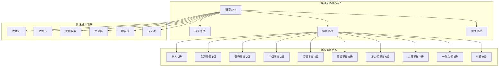
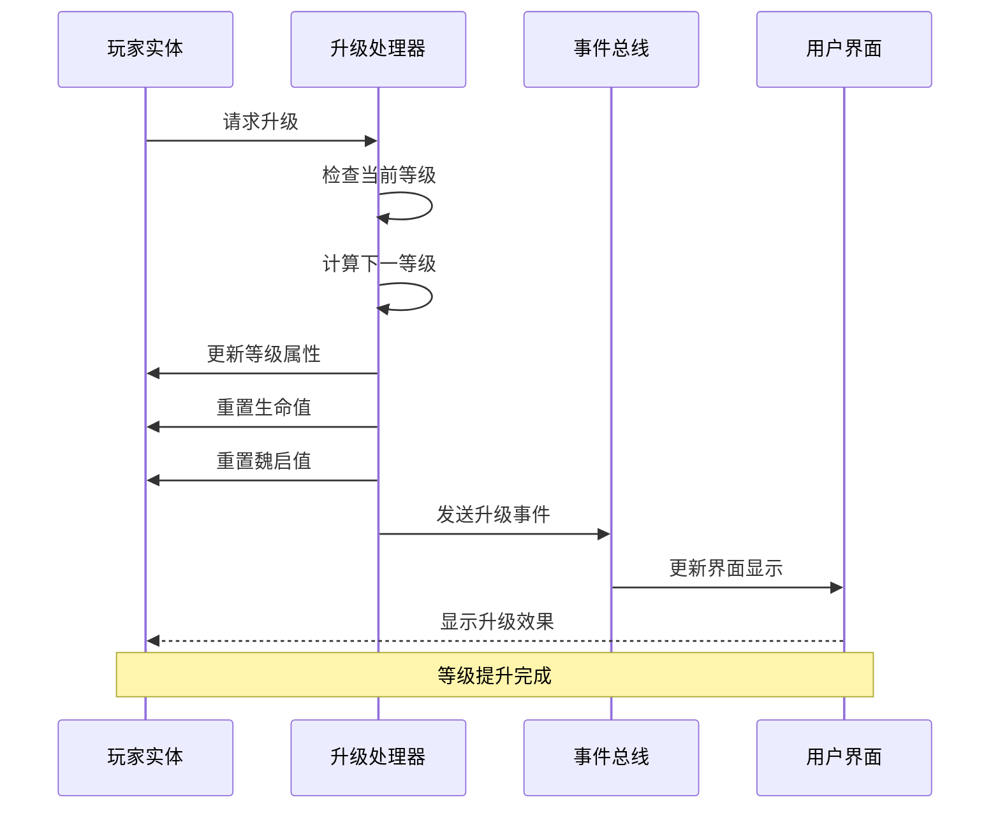
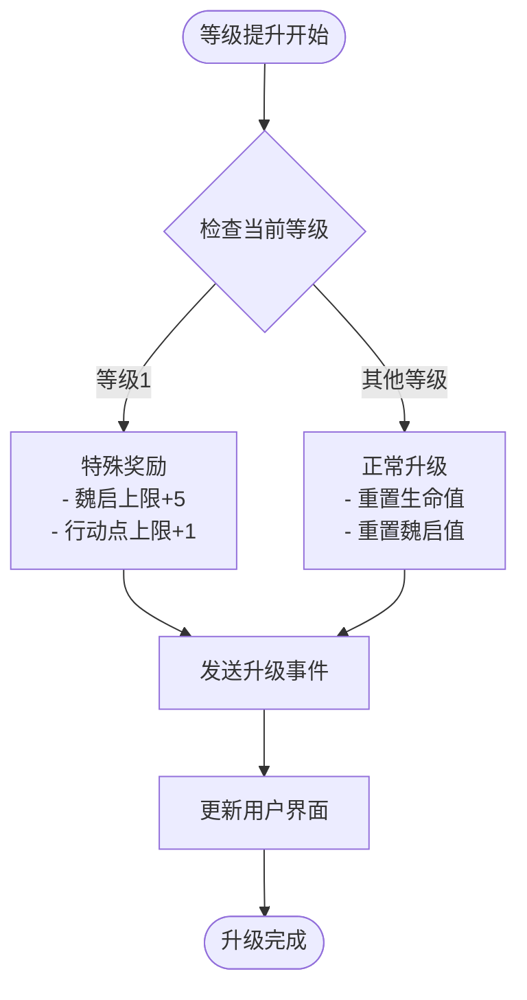
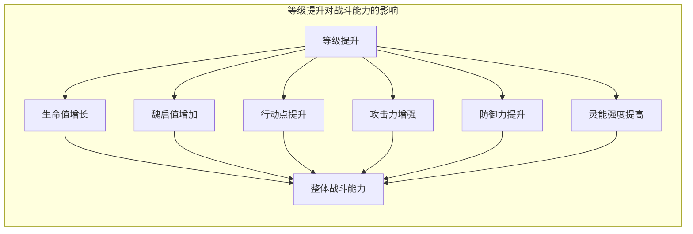

# 等级与成长机制

<cite>
**本文档中引用的文件**
- [src/data/player.js](file://src/data/player.js)
- [src/data/unit.js](file://src/data/unit.js)
- [src/utils/tierUtils.js](file://src/utils/tierUtils.js)
- [src/data/skill.js](file://src/data/skill.js)
- [src/data/skillManager.js](file://src/data/skillManager.js)
- [src/data/enemy.js](file://src/data/enemy.js)
- [src/data/battleUtils.js](file://src/data/battleUtils.js)
- [src/data/gameState.js](file://src/data/gameState.js)
- [src/data/skills/martial_arts/heavySmash.js](file://src/data/skills/martial_arts/heavySmash.js)
</cite>

## 目录
1. [引言](#引言)
2. [等级系统架构概览](#等级系统架构概览)
3. [玩家等级系统详解](#玩家等级系统详解)
4. [基础单位属性体系](#基础单位属性体系)
5. [技能等级与成长机制](#技能等级与成长机制)
6. [属性成长曲线设计](#属性成长曲线设计)
7. [战斗能力影响分析](#战斗能力影响分析)
8. [游戏平衡性贡献](#游戏平衡性贡献)
9. [性能优化策略](#性能优化策略)
10. [故障排除指南](#故障排除指南)
11. [总结](#总结)

## 引言

本游戏采用了一套精心设计的等级与成长机制，通过tier字段为核心，构建了一个多层次的角色成长体系。该系统不仅实现了角色从初级灵御到传奇大师的成长路径，还通过技能等级、属性成长和战斗能力的有机结合，为玩家提供了丰富的策略选择和深度的游戏体验。

等级系统的核心设计理念是"渐进式成长"，通过固定的等阶层级和灵活的属性修正机制，确保每个玩家都能找到适合自己的成长节奏。同时，系统还引入了灵脉因子、技能升级和效果叠加等复杂机制，为游戏深度提供了坚实的基础。

## 等级系统架构概览



**图表来源**
- [src/data/player.js](file://src/data/player.js#L1-L226)
- [src/data/unit.js](file://src/data/unit.js#L1-L143)
- [src/utils/tierUtils.js](file://src/utils/tierUtils.js#L1-L218)

## 玩家等级系统详解

### 等级定义与标识

玩家等级系统通过`tier`字段进行标识，支持从0级到9级的完整成长路径。每个等级都有对应的名称和视觉标识，形成了完整的等级体系：

```javascript
// 等级索引映射
const tiers = [
  {tier: 0, name: '旅人'},
  {tier: 1, name: '见习灵御'},
  {tier: 2, name: '普通灵御'},
  {tier: 3, name: '中级灵御'},
  {tier: 4, name: '资深灵御'},
  {tier: 5, name: '高级灵御'},
  {tier: 6, name: '准大师灵御'},
  {tier: 7, name: '大师灵御'},
  {tier: 8, name: '一代宗师'},
  {tier: 9, name: '传奇'}
];
```

### 等级升级机制

等级升级通过`upgradePlayerTier`函数实现，该函数负责处理等级提升时的各种状态更新：

```javascript
export function upgradePlayerTier (player) {
  const nextTier = getNextPlayerTier(player.tier);
  if (nextTier !== undefined) {
    player.tier = nextTier;
    if (player.tier === 1) {
      // 特殊：第一次升级时给5魏启上限
      player.maxMana = 5;
    }
    if (player.maxActionPoints < 4) {
      player.maxActionPoints++;
    }
  }
  player.hp = player.maxHp;
  player.mana = player.maxMana;
  backendEventBus.emit(EventNames.Player.TIER_UPGRADED, player);
  return true;
}
```

### 等级升级流程



**图表来源**
- [src/data/player.js](file://src/data/player.js#L10-L25)

**章节来源**
- [src/data/player.js](file://src/data/player.js#L1-L226)
- [src/utils/tierUtils.js](file://src/utils/tierUtils.js#L1-L218)

## 基础单位属性体系

### 单位属性继承关系

游戏中的所有战斗单位都继承自`Unit`基类，该类定义了所有单位共有的基础属性：

```javascript
export default class Unit {
  constructor() {
    this.type = 'unit';
    this.name = '';
    this.hp = 0; // 当前生命值
    this.maxHp = 0; // 最大生命值
    this.shield = 0; // 当前护盾
    this.baseAttack = 0; // 基础攻击力
    this.baseDefense = 0; // 基础防御力
    this.baseMagic = 0; // 基础灵能强度
    this.effects = {}; // 效果列表
  }
}
```

### 动态属性计算

基础单位通过getter方法实现动态属性计算，这些属性会根据当前状态自动调整：

```javascript
// 攻击力计算：基础攻击 + 效果加成
get attack() {
  return this.baseAttack + (this.effects['力量'] || 0);
}

// 防御力计算：基础防御 + 效果加成
get defense() {
  return this.baseDefense + (this.effects['坚固'] || 0);
}

// 灵能强度计算：基础灵能 + 效果加成
get magic() {
  return this.baseMagic + (this.effects['集中'] || 0);
}
```

### 属性修正系统

玩家实体还实现了复杂的属性修正系统，允许动态修改属性值而不影响原始数据：

```javascript
export function createPlayerStatModifier({ attack, defense, magic } = {}) {
  return function(player) {
    return new Proxy(player, {
      get(target, prop, receiver) {
        if (prop === 'attack') {
          const base = Reflect.get(target, 'attack', receiver);
          return typeof attack === 'function' ? attack(base, receiver) : base;
        }
        if (prop === 'defense') {
          const base = Reflect.get(target, 'defense', receiver);
          return typeof defense === 'function' ? defense(base, receiver) : base;
        }
        if (prop === 'magic') {
          const base = Reflect.get(target, 'magic', receiver);
          return typeof magic === 'function' ? magic(base, receiver) : base;
        }
        return Reflect.get(target, prop, receiver);
      }
    });
  }
}
```

**章节来源**
- [src/data/unit.js](file://src/data/unit.js#L1-L143)
- [src/data/player.js](file://src/data/player.js#L30-L80)

## 技能等级与成长机制

### 技能等级体系

技能系统采用了与玩家等级相对应的等级体系，支持从D级到S级的完整技能等级：

```javascript
const SKILL_TIER_MAP = {
  '-1': '特殊技能',
  '0': 'D级',
  '1': 'C-级',
  '2': 'C+级',
  '3': 'B-级',
  '4': 'B级',
  '5': 'B+级',
  '6': 'A-级',
  '7': 'A级',
  '8': 'A+级',
  '9': 'S级'
};
```

### 技能升级逻辑

技能升级通过前置技能系统实现，形成技能树状结构：

```javascript
// 技能升级候选逻辑
const upgradeCandidates = [];
for (const meta of allSkills) {
  if (playerSkillNames.includes(meta.name)) continue; // 已拥有不加入
  if (meta.tier > playerTier) continue; // 等阶限制
  if (!meta.precessor) continue; // 没有前置技能

  let matchedSource = null;
  if (Array.isArray(meta.precessor)) {
    matchedSource = meta.precessor.find(p => playerSkillNames.includes(p)) || null;
  } else if (typeof meta.precessor === 'string') {
    matchedSource = playerSkillNames.includes(meta.precessor) ? meta.precessor : null;
  }
  if (!matchedSource) continue; // 玩家没有其任意前置技能

  upgradeCandidates.push({ ...meta, isUpgradeCandidate: true, upgradedFrom: matchedSource });
}
```

### 技能权重计算

技能出现权重根据玩家等级和技能等级进行动态调整：

```javascript
const weightedSkills = availableSkills.map(skill => {
  const tierDifference = playerTier - skill.tier;
  let modifyFactor = 1;

  // 高等级技能出现权重降低
  if (skill.tier >= 8) modifyFactor *= 0.7;
  if (skill.tier >= 5) modifyFactor *= 0.8;

  // 等级太低的技能出现权重大幅降低
  if (tierDifference > 7) {
    modifyFactor = 0.15;
  } else if (tierDifference > 6) {
    modifyFactor = 0.40;
  } else if (tierDifference > 5) {
    modifyFactor = 0.70;
  }

  // 高质量奖励中，贴近玩家等级上限技能概率大幅提升
  if(bestQuality && tierDifference < 1) modifyFactor *= 5;
  if(bestQuality && tierDifference < 2) modifyFactor *= 3;

  return { ...skill, weight: modifyFactor };
});
```

**章节来源**
- [src/utils/tierUtils.js](file://src/utils/tierUtils.js#L1-L218)
- [src/data/skillManager.js](file://src/data/skillManager.js#L100-L184)
- [src/data/skill.js](file://src/data/skill.js#L1-L205)

## 属性成长曲线设计

### 固定成长与随机成长结合

游戏采用了固定成长与随机成长相结合的属性增长策略。固定成长体现在等级提升时的基础属性增加，而随机成长则通过技能升级和效果叠加实现：

```javascript
// 玩家基础属性
export class Player extends Unit {
  constructor() {
    super();
    this.type = 'player';
    this.name = "你";
    this.hp = 65;
    this.maxHp = 65;
    this.mana = 0;
    this.maxMana = 0;
    this.baseAttack = 0;
    this.baseMagic = 1;
    this.baseDefense = 0;
    this.remainingActionPoints = 3;
    this.maxActionPoints = 3;
    this.tier = 1;
  }
}
```

### 等级提升时的属性变化



**图表来源**
- [src/data/player.js](file://src/data/player.js#L10-L25)

### 灵脉因子系统

玩家还拥有灵脉因子系统，影响技能出现概率和属性成长方向：

```javascript
addLeino(type, value) {
  if (this.leinoFactors[type]) {
    this.leinoFactors[type] += value;
  }
  else {
    this.leinoFactors[type] = value;
  }
}

getLeinoWeight(type) {
  return Math.max(this.leinoFactors[type] || 0, 0);
}

getAllLeinoWeight() {
  return Object.values(this.leinoFactors).reduce((sum, val) => sum + val, 0);
}
```

**章节来源**
- [src/data/player.js](file://src/data/player.js#L80-L120)

## 战斗能力影响分析

### 攻击力成长对战斗的影响

随着等级提升，玩家的攻击力、防御力和灵能强度都会显著增强：

```javascript
// 攻击力计算公式
get attack() {
  return this.baseAttack + (this.effects['力量'] || 0);
}

// 防御力计算公式
get defense() {
  return this.baseDefense + (this.effects['坚固'] || 0);
}

// 灵能强度计算公式
get magic() {
  return this.baseMagic + (this.effects['集中'] || 0);
}
```

### 战斗资源管理

等级提升带来的不仅仅是属性增强，还包括战斗资源的扩充：

```javascript
// 行动点管理
consumeActionPoints(amount) {
  this.remainingActionPoints -= amount;
  this.remainingActionPoints = Math.max(this.remainingActionPoints, 0);
}

// 魏启值管理
consumeMana(amount) {
  this.mana -= amount;
  this.mana = Math.max(this.mana, 0);
  this.mana = Math.min(this.mana, this.maxMana);
}

gainMana(amount) {
  this.mana += amount;
  this.mana = Math.max(this.mana, 0);
  this.mana = Math.min(this.mana, this.maxMana);
}
```

### 战斗能力综合评估



**图表来源**
- [src/data/player.js](file://src/data/player.js#L150-L200)

**章节来源**
- [src/data/player.js](file://src/data/player.js#L150-L226)
- [src/data/battleUtils.js](file://src/data/battleUtils.js#L1-L365)

## 游戏平衡性贡献

### 等级系统的平衡设计

等级系统通过多维度的平衡机制确保游戏的公平性和挑战性：

1. **等级差距控制**：通过tierDifference参数控制低等级技能的出现概率
2. **技能权重调整**：高等级技能出现权重降低，防止玩家过早获得强力技能
3. **属性成长曲线**：固定成长与随机成长相结合，既保证稳定性又提供多样性

### 游戏难度曲线

```javascript
// 难度调整权重
if (tierDifference > 7) {
  modifyFactor = 0.15; // 极低概率
} else if (tierDifference > 6) {
  modifyFactor = 0.40; // 较低概率
} else if (tierDifference > 5) {
  modifyFactor = 0.70; // 中等概率
}
```

### 平衡性验证机制

系统通过以下机制确保平衡性：
- 技能出现权重的动态调整
- 等级差距对技能选择的影响
- 灵脉因子对技能适配度的调节
- 效果叠加的上限控制

**章节来源**
- [src/data/skillManager.js](file://src/data/skillManager.js#L154-L184)

## 性能优化策略

### 属性计算优化

系统采用了多种性能优化策略：

1. **代理模式缓存**：通过Proxy对象缓存修正后的属性值
2. **延迟计算**：只有在访问属性时才进行计算
3. **效果过滤**：只对有效效果进行处理

```javascript
// 属性修正器管线优化
getModifiedPlayer() {
  if(this.modified) return this; // 已经是修正过的，直接返回自己
  let current = this;
  for (const mod of this.modifiers) {
    try {
      const next = mod(current);
      if (next) current = next;
    } catch (e) {
      console.warn('应用属性修正器时发生错误，已跳过：', e);
    }
  }
  return current;
}
```

### 内存管理优化

- 使用对象池减少垃圾回收压力
- 实现高效的事件监听器管理
- 优化大量效果同时存在时的性能

### 动画性能优化

系统通过动画序列器优化战斗动画性能：

```javascript
// 动画指令优化
export function drawSkillCard(player, number = 1) {
  number = Math.min(number, player.maxDrawSkillCardCount);
  let returnSkill = null;
  let ids = [];
  for (let i = 0; i < number; i++) {
    if (player.frontierSkills.length >= player.maxHandSize) break;
    if (player.backupSkills.length === 0) break;
    
    const firstSkill = player.backupSkills.shift();
    if (firstSkill && firstSkill.uniqueID) {
      player.frontierSkills.push(firstSkill);
      ids.push(firstSkill.uniqueID);
    }
    if(i === 0) {
      returnSkill = firstSkill;
    }
  }
  // 批量动画处理
  ids.forEach((id) => {
    enqueueAnimateCardById(
      {id: id, kind: 'appearFromAnchor', options: {anchor: 'deck', durationMs: 500, startScale: 0.6, fade: true}}
    );
  });
  return returnSkill;
}
```

**章节来源**
- [src/data/player.js](file://src/data/player.js#L120-L150)
- [src/data/battleUtils.js](file://src/data/battleUtils.js#L150-L200)

## 故障排除指南

### 常见等级系统问题

1. **等级升级失败**
   - 检查`getNextPlayerTier`函数的返回值
   - 确认玩家状态是否正确
   - 验证事件总线连接

2. **属性计算异常**
   - 检查`effects`对象的状态
   - 验证属性修正器链
   - 确认Proxy对象的配置

3. **技能出现概率异常**
   - 检查`tierDifference`计算
   - 验证权重因子设置
   - 确认玩家等级状态

### 调试工具和方法

```javascript
// 等级调试工具
function debugPlayerTier(player) {
  console.log('当前等级:', player.tier);
  console.log('等级名称:', getPlayerTierFromTierIndex(player.tier).name);
  console.log('下一级:', getNextPlayerTier(player.tier));
  console.log('等级权重:', getPlayerTierColor(player.tier));
}

// 属性调试工具
function debugPlayerStats(player) {
  console.log('基础攻击:', player.baseAttack);
  console.log('基础防御:', player.baseDefense);
  console.log('基础灵能:', player.baseMagic);
  console.log('当前攻击:', player.attack);
  console.log('当前防御:', player.defense);
  console.log('当前灵能:', player.magic);
}
```

### 性能监控

系统提供了详细的性能监控功能：

```javascript
// 性能监控
const performanceMonitor = {
  startTime: Date.now(),
  memoryUsage: {},
  
  recordMemoryUsage() {
    if (performance.memory) {
      this.memoryUsage = {
        usedJSHeapSize: performance.memory.usedJSHeapSize,
        totalJSHeapSize: performance.memory.totalJSHeapSize,
        jsHeapSizeLimit: performance.memory.jsHeapSizeLimit
      };
    }
  },
  
  logPerformance() {
    const currentTime = Date.now();
    console.log('运行时间:', currentTime - this.startTime, 'ms');
    console.log('内存使用:', this.memoryUsage);
  }
};
```

## 总结

本游戏的等级与成长机制通过精心设计的tier系统，为玩家提供了一个完整而富有深度的角色成长体系。该系统的主要特点包括：

### 核心优势

1. **层次分明的等级体系**：从旅人到传奇的完整成长路径
2. **灵活的属性修正系统**：支持动态属性调整和效果叠加
3. **智能的技能成长机制**：基于前置技能的树状升级结构
4. **平衡的难度曲线**：通过权重调整确保游戏挑战性
5. **优秀的性能表现**：通过多种优化策略保证流畅体验

### 设计理念

- **渐进式成长**：每个等级都有明确的目标和奖励
- **多样化选择**：通过灵脉因子和技能树提供不同的成长路径
- **深度策略性**：等级提升带来多重能力增强，需要玩家制定相应策略
- **平衡性保障**：通过算法和权重控制确保游戏公平性

### 未来发展方向

1. **动态难度调整**：根据玩家表现自动调整等级提升速度
2. **个性化成长路径**：提供更多职业和专精选项
3. **社交互动系统**：引入公会和团队等级系统
4. **成就系统整合**：将等级系统与成就系统深度结合

这套等级与成长机制不仅为玩家提供了丰富的内容体验，也为游戏的长期发展奠定了坚实的基础。通过持续的优化和改进，该系统将继续为玩家带来更加精彩的游戏体验。