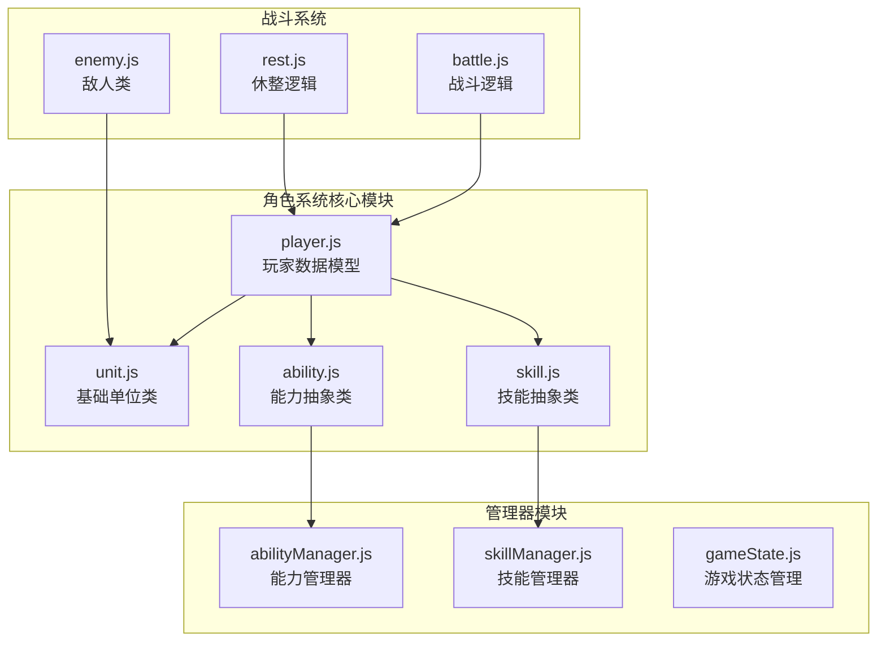
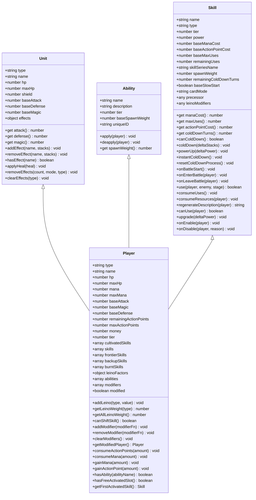
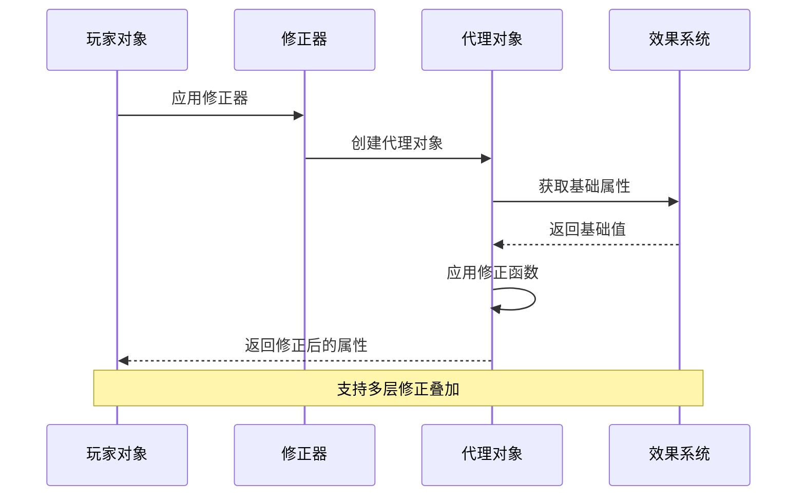
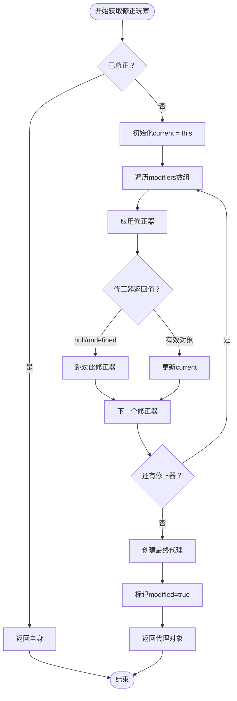
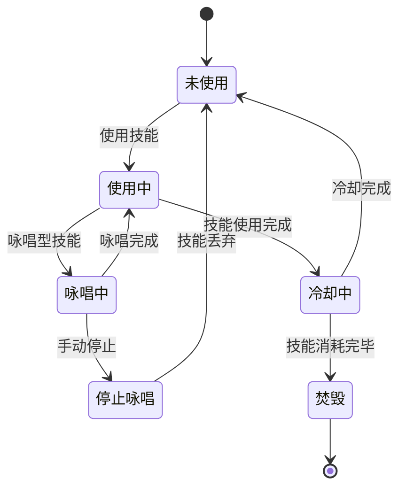
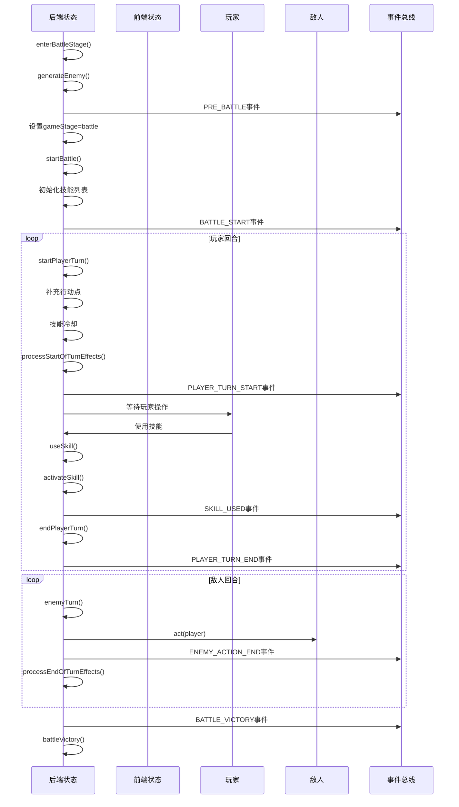
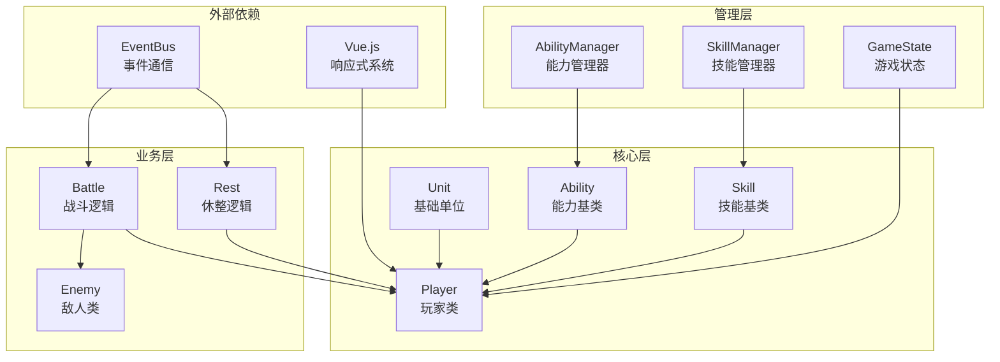

# 角色系统

<cite>
**本文档中引用的文件**
- [player.js](file://src/data/player.js)
- [unit.js](file://src/data/unit.js)
- [ability.js](file://src/data/ability.js)
- [abilityManager.js](file://src/data/abilityManager.js)
- [skill.js](file://src/data/skill.js)
- [battle.js](file://src/data/battle.js)
- [gameState.js](file://src/data/gameState.js)
- [rest.js](file://src/data/rest.js)
- [enemy.js](file://src/data/enemy.js)
- [punch.js](file://src/data/skills/martial_arts/punch.js)
</cite>

## 目录
1. [简介](#简介)
2. [项目结构](#项目结构)
3. [核心组件](#核心组件)
4. [架构概览](#架构概览)
5. [详细组件分析](#详细组件分析)
6. [依赖关系分析](#依赖关系分析)
7. [性能考虑](#性能考虑)
8. [故障排除指南](#故障排除指南)
9. [结论](#结论)

## 简介

角色系统是《灵御》游戏的核心机制，负责管理玩家角色的数据模型、属性系统、成长机制和状态持久化。该系统采用面向对象设计，通过继承和组合模式实现了灵活的角色属性计算、技能管理和能力系统。

系统的主要特点包括：
- 基于Unit类的统一属性计算框架
- 灵活的属性修正系统，支持多层叠加
- 分层的角色成长体系（旅人到传奇）
- 完整的技能管理系统
- 实时的状态持久化和序列化机制

## 项目结构

角色系统的核心文件分布在`src/data`目录下，采用模块化设计：



**图表来源**
- [player.js](file://src/data/player.js#L1-L226)
- [unit.js](file://src/data/unit.js#L1-L143)
- [ability.js](file://src/data/ability.js#L1-L27)
- [skill.js](file://src/data/skill.js#L1-L205)

## 核心组件

### Player类 - 玩家数据模型

Player类是整个角色系统的核心，继承自Unit类，扩展了玩家特有的属性和方法：

```javascript
export class Player extends Unit {
  constructor() {
    super();
    this.type = 'player';
    this.name = "你";
    this.hp = 65;
    this.maxHp = 65;
    this.mana = 0;
    this.maxMana = 0;
    this.baseAttack = 0;
    this.baseMagic = 1;
    this.baseDefense = 0;
    this.remainingActionPoints = 3;
    this.maxActionPoints = 3;
    this.money = 0;
    this.tier = 1;
    // 技能养成系统
    this.maxSkills = 20;
    this.cultivatedSkills = [];
    this.skills = [];
    this.frontierSkills = [];
    this.backupSkills = [];
    this.burntSkills = [];
    // 灵脉系统
    this.leinoFactors = {};
    // 能力系统
    this.abilities = [];
    // 属性修正器
    this.modifiers = [];
    this.modified = false;
  }
}
```

**章节来源**
- [player.js](file://src/data/player.js#L67-L117)

### Unit类 - 基础单位抽象

Unit类提供了所有战斗单位的基础属性和计算逻辑：

```javascript
export default class Unit {
  constructor() {
    this.type = 'unit';
    this.name = '';
    this.hp = 0;
    this.maxHp = 0;
    this.shield = 0;
    this.baseAttack = 0;
    this.baseDefense = 0;
    this.baseMagic = 0;
    this.effects = {};
  }

  get attack() {
    return this.baseAttack + (this.effects['力量'] || 0);
  }

  get defense() {
    return this.baseDefense + (this.effects['坚固'] || 0);
  }

  get magic() {
    return this.baseMagic + (this.effects['集中'] || 0);
  }
}
```

**章节来源**
- [unit.js](file://src/data/unit.js#L5-L25)

## 架构概览

角色系统采用分层架构设计，从底层的基础单位到顶层的游戏状态管理：



**图表来源**
- [unit.js](file://src/data/unit.js#L5-L143)
- [player.js](file://src/data/player.js#L67-L117)
- [ability.js](file://src/data/ability.js#L3-L27)
- [skill.js](file://src/data/skill.js#L5-L205)

## 详细组件分析

### 属性修正系统

属性修正系统是角色系统的核心特性之一，通过Proxy模式实现了灵活的属性计算和叠加机制：



**图表来源**
- [player.js](file://src/data/player.js#L36-L63)
- [player.js](file://src/data/player.js#L163-L204)

#### 修正器工厂函数

系统提供了便捷的修正器工厂函数：

```javascript
export function createPlayerStatModifier({ attack, defense, magic } = {}) {
  return function(player) {
    return new Proxy(player, {
      get(target, prop, receiver) {
        if (prop === 'attack') {
          const base = Reflect.get(target, 'attack', receiver);
          return typeof attack === 'function' ? attack(base, receiver) : base;
        }
        if (prop === 'defense') {
          const base = Reflect.get(target, 'defense', receiver);
          return typeof defense === 'function' ? defense(base, receiver) : base;
        }
        if (prop === 'magic') {
          const base = Reflect.get(target, 'magic', receiver);
          return typeof magic === 'function' ? magic(base, receiver) : base;
        }
        return Reflect.get(target, prop, receiver);
      }
    });
  }
}
```

#### 修正器应用流程



**图表来源**
- [player.js](file://src/data/player.js#L163-L204)

**章节来源**
- [player.js](file://src/data/player.js#L36-L63)
- [player.js](file://src/data/player.js#L163-L204)

### 等级和成长系统

#### 等级晋升机制

```javascript
export function getNextPlayerTier(playerTier) {
  const tierUpgrades = { 0: 1, 1: 2, 2: 3, 3: 4, 4: 5, 5: 6, 6: 7, 7: 8, 8: 9 };
  return tierUpgrades[playerTier];
}

export function upgradePlayerTier (player) {
  const nextTier = getNextPlayerTier(player.tier);
  if (nextTier !== undefined) {
    player.tier = nextTier;
    if (player.tier === 1) {
      // 特殊：第一次升级时给5魏启上限
      player.maxMana = 5;
    }
    if (player.maxActionPoints < 4) {
      player.maxActionPoints++;
    }
  }
  player.hp = player.maxHp;
  player.mana = player.maxMana;
  backendEventBus.emit(EventNames.Player.TIER_UPGRADED, player);
  return true;
}
```

#### 等级描述映射

```javascript
export function getPlayerTierFromTierIndex(tierIndex) {
  const tiers = [
    {tier: 0, name: '旅人'},
    {tier: 1, name: '见习灵御'},
    {tier: 2, name: '普通灵御'},
    {tier: 3, name: '中级灵御'},
    {tier: 4, name: '资深灵御'},
    {tier: 5, name: '高级灵御'},
    {tier: 6, name: '准大师灵御'},
    {tier: 7, name: '大师灵御', subtitle: '古往今来，灵御协会所能给出的最高认可'},
    {tier: 8, name: '一代宗师', subtitle: '和独开一代的宗师们并肩而立'},
    {tier: 9, name: '传奇', subtitle: '即便肉身消陨，你的名字也会回荡于传说之中'}
  ];
  return tiers[tierIndex];
}
```

**章节来源**
- [player.js](file://src/data/player.js#L4-L25)
- [player.js](file://src/data/player.js#L27-L40)

### 灵脉系统

灵脉系统是角色成长的重要组成部分，影响技能生成和卡牌出现概率：

```javascript
// 添加灵脉因子
addLeino(type, value) {
  if (this.leinoFactors[type]) {
    this.leinoFactors[type] += value;
  }
  else {
    this.leinoFactors[type] = value;
  }
}

// 获取特定灵脉权重
getLeinoWeight(type) {
  return Math.max(this.leinoFactors[type] || 0, 0);
}

// 获取所有灵脉总权重
getAllLeinoWeight() {
  return Object.values(this.leinoFactors).reduce((sum, val) => sum + val, 0);
}
```

**章节来源**
- [player.js](file://src/data/player.js#L119-L129)

### 技能管理系统

#### 技能生命周期



#### 技能冷却系统

```javascript
// 技能冷却推进
coldDown(deltaStacks = 1) {
  if (this.coldDownTurns !== 0) {
    if (this.remainingUses !== this.maxUses) {
      this.remainingColdDownTurns = Math.max(this.remainingColdDownTurns - deltaStacks, 0);
      this.remainingColdDownTurns = Math.min(this.remainingColdDownTurns, this.coldDownTurns);
      let charged = false;
      if (this.remainingColdDownTurns <= 0) {
        this.remainingColdDownTurns = this.coldDownTurns;
        this.remainingUses = Math.min(this.remainingUses + 1, this.maxUses);
        charged = true;
      }
      this._emitCooldownTick(deltaStacks);
    }
  }
}
```

**章节来源**
- [skill.js](file://src/data/skill.js#L85-L105)

### 能力系统

#### 能力抽象类

```javascript
export class Ability {
  constructor(name, description, tier, baseSpawnWeight = 1) {
    this.name = name;
    this.description = description;
    this.tier = tier || 1;
    this.baseSpawnWeight = baseSpawnWeight;
    this.uniqueID = Math.random().toString(36).substring(2, 10);
  }
  
  apply(player) {
    // 子类需要实现具体逻辑
  }

  deapply(player) {
    // 子类需要实现具体逻辑
  }

  get spawnWeight() {
    return this.baseSpawnWeight;
  }
}
```

#### 能力管理器

```javascript
class AbilityManager {
  constructor() {
    this.abilities = [];
  }

  // 随机获取能力
  getRandomAbilities(count = 3, abundance = 1.0) {
    const allAbilities = this.abilities.map(a => ({
      name: a.name,
      tier: a.tier,
      spawnWeight: (new a.AbilityClass()).spawnWeight
    }));
    
    // 根据abundance、spawnWeight和tier计算每个能力的权重
    const weightedAbilities = allAbilities.map(ability => {
      let offset = Math.max(1, abundance * 2);
      const tierFactor = Math.pow(0.6, Math.max(ability.tier - offset, 0));
      const rarityFactor = ability.spawnWeight;
      const weight = tierFactor * rarityFactor;
      
      return { ...ability, weight };
    });
    
    // 根据权重随机选择能力
    const selected = [];
    let availableAbilities = weightedAbilities;
    const maxEntries = Math.min(count, availableAbilities.length);
    
    for (let i = 0; i < maxEntries; i++) {
      const totalWeight = availableAbilities.reduce((sum, ability) => sum + ability.weight, 0);
      let random = Math.random() * totalWeight;
      
      let selectedIndex = 0;
      for (let j = 0; j < availableAbilities.length; j++) {
        random -= availableAbilities[j].weight;
        if (random <= 0) {
          selectedIndex = j;
          break;
        }
      }
      
      const selectedAbility = this.createAbility(availableAbilities[selectedIndex].name);
      selected.push(selectedAbility);
      availableAbilities.splice(selectedIndex, 1);
    }
    
    return selected;
  }
}
```

**章节来源**
- [ability.js](file://src/data/ability.js#L3-L27)
- [abilityManager.js](file://src/data/abilityManager.js#L1-L118)

### 战斗状态管理

#### 游戏状态结构

```javascript
export function createGameState() {
  return {
    gameStage: 'start',
    restScreenStage: '',
    isRemiPresent: false,
    isVictory: false,
    isEnemyTurn: false,
    get isPlayerTurn() { return !this.isEnemyTurn; },
    player: reactive(new Player()),
    enemy: {},
    rewards: {
      breakthrough: false,
      money: 0,
      skills: [],
      abilities: []
    },
    shopItems: [],
    battleCount: 0
  };
}
```

#### 战斗流程控制



**图表来源**
- [battle.js](file://src/data/battle.js#L15-L50)
- [battle.js](file://src/data/battle.js#L52-L100)

**章节来源**
- [gameState.js](file://src/data/gameState.js#L7-L30)
- [battle.js](file://src/data/battle.js#L15-L50)

## 依赖关系分析

角色系统的依赖关系呈现清晰的层次结构：



**图表来源**
- [player.js](file://src/data/player.js#L1-L5)
- [unit.js](file://src/data/unit.js#L1-L5)
- [gameState.js](file://src/data/gameState.js#L1-L5)

**章节来源**
- [player.js](file://src/data/player.js#L1-L5)
- [unit.js](file://src/data/unit.js#L1-L5)
- [gameState.js](file://src/data/gameState.js#L1-L5)

## 性能考虑

### 属性计算优化

1. **Proxy缓存机制**：修正器返回的代理对象会被缓存，避免重复计算
2. **懒加载策略**：只有在访问属性时才进行计算
3. **效果系统优化**：使用Map结构存储效果，提高查找效率

### 内存管理

1. **对象池模式**：技能对象通过克隆机制复用
2. **及时清理**：战斗结束后自动清理技能列表和效果
3. **弱引用使用**：在适当场景使用WeakMap避免内存泄漏

### 并发处理

1. **事件驱动架构**：通过EventBus解耦组件，支持异步处理
2. **状态隔离**：前后端状态独立，避免竞态条件
3. **事务性操作**：关键操作使用原子性事务确保一致性

## 故障排除指南

### 常见问题及解决方案

#### 属性修正失效

**症状**：属性修正器没有生效
**原因**：修正器函数返回null或抛出异常
**解决**：检查修正器函数逻辑，确保返回有效的Player对象

```javascript
// 错误示例
player.addModifier(() => null);

// 正确示例
player.addModifier((player) => {
  return new Proxy(player, {
    get(target, prop, receiver) {
      if (prop === 'attack') {
        return target.attack + 10;
      }
      return Reflect.get(target, prop, receiver);
    }
  });
});
```

#### 技能冷却异常

**症状**：技能冷却时间不正确
**原因**：冷却计算逻辑错误或事件监听器未正确移除
**解决**：检查`coldDown()`方法实现，确保事件正确处理

#### 等级晋升问题

**症状**：等级升级失败或属性不更新
**原因**：tier状态未正确更新或事件未触发
**解决**：验证`upgradePlayerTier()`函数调用，确保状态同步

**章节来源**
- [player.js](file://src/data/player.js#L163-L204)
- [skill.js](file://src/data/skill.js#L85-L105)
- [player.js](file://src/data/player.js#L27-L40)

## 结论

角色系统是一个设计精良、功能完备的游戏角色管理框架。它通过以下特点实现了优秀的游戏体验：

### 主要优势

1. **模块化设计**：清晰的职责分离，便于维护和扩展
2. **灵活的属性系统**：支持多层叠加的修正机制
3. **完整的生命周期管理**：从创建到销毁的完整流程控制
4. **强大的扩展性**：易于添加新的能力、技能和效果
5. **良好的性能表现**：优化的计算和内存管理策略

### 设计亮点

- **面向对象编程**：合理的继承和组合关系
- **事件驱动架构**：松耦合的组件通信机制
- **响应式状态管理**：Vue.js集成的实时状态更新
- **类型安全**：充分的参数验证和错误处理

### 改进建议

1. **性能监控**：添加性能指标收集和分析
2. **调试工具**：开发环境下的状态可视化工具
3. **文档完善**：更详细的API文档和使用示例
4. **测试覆盖**：增加单元测试和集成测试覆盖率

角色系统为《灵御》游戏提供了坚实的基础，其设计理念和实现方式值得在类似项目中借鉴和应用。