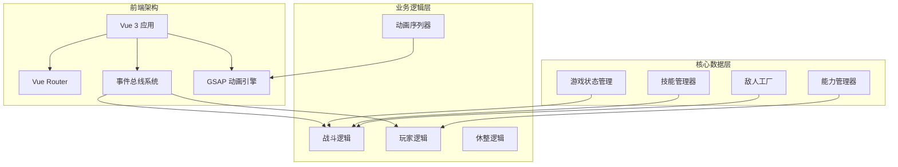
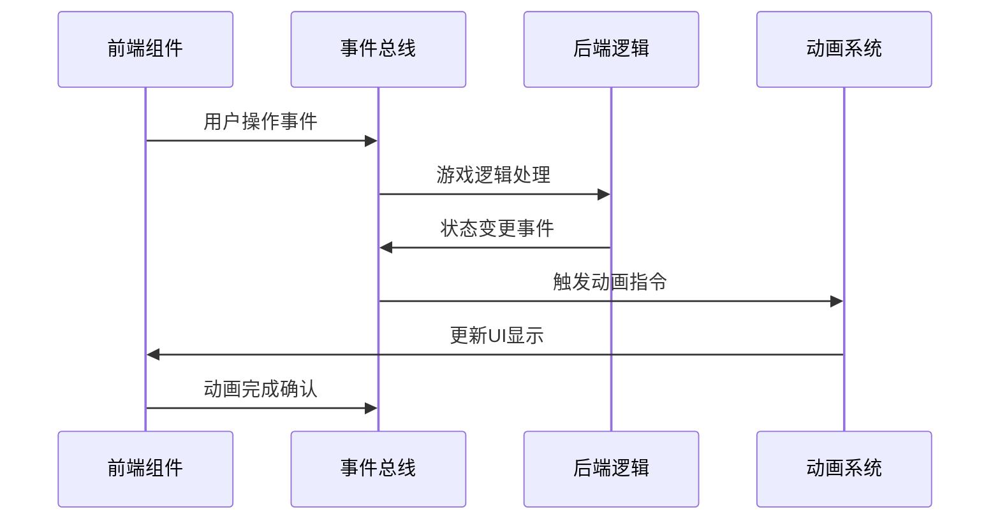
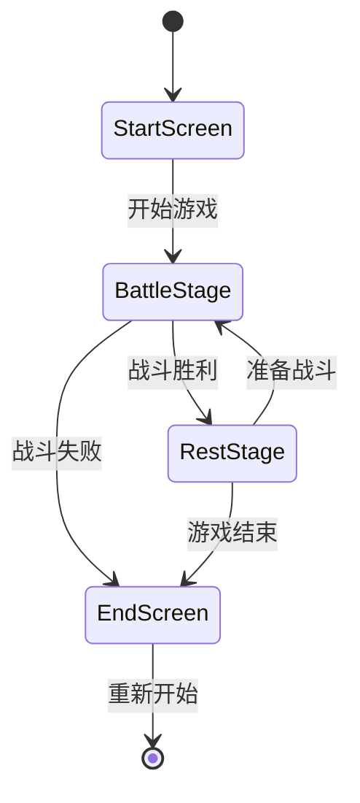
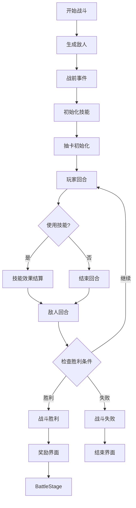
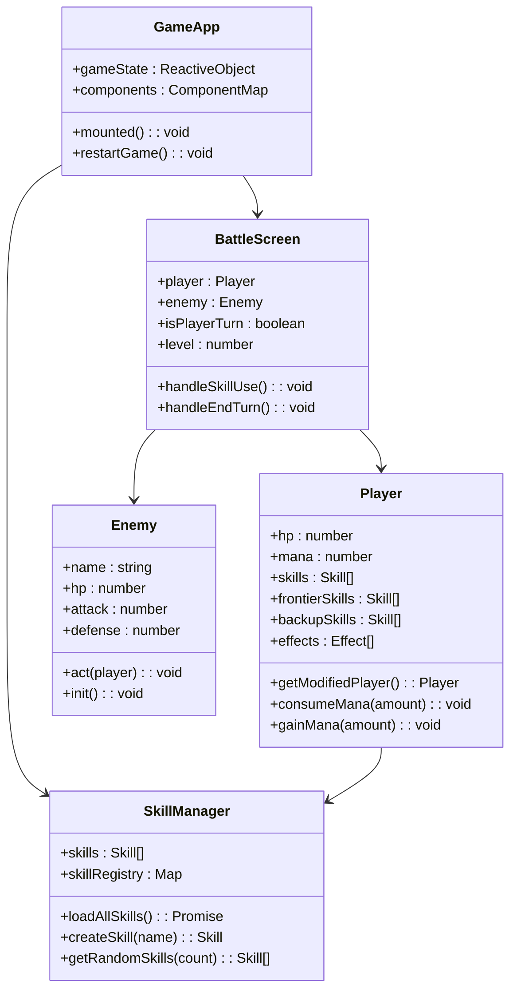
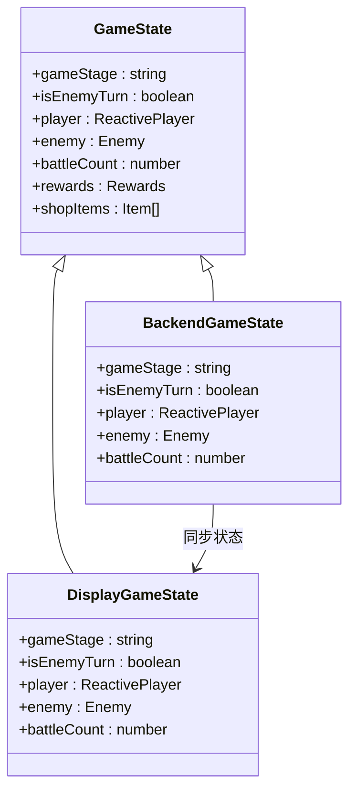
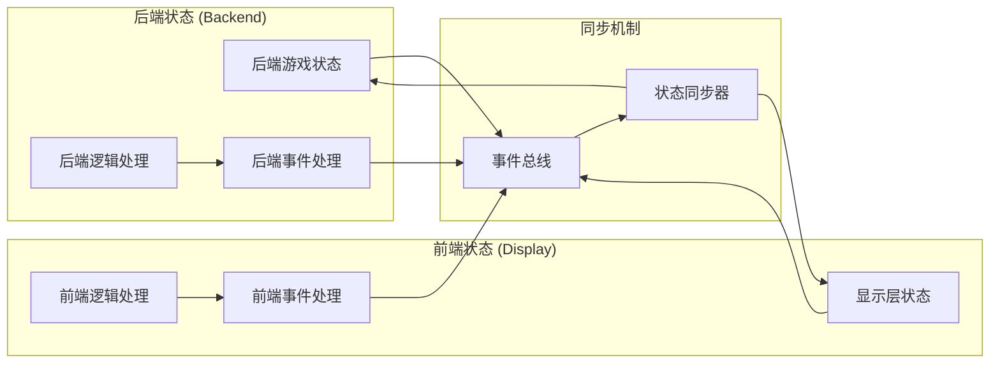
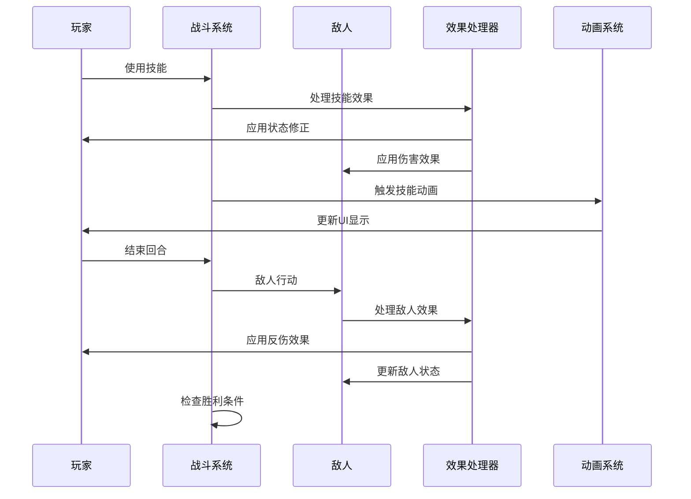
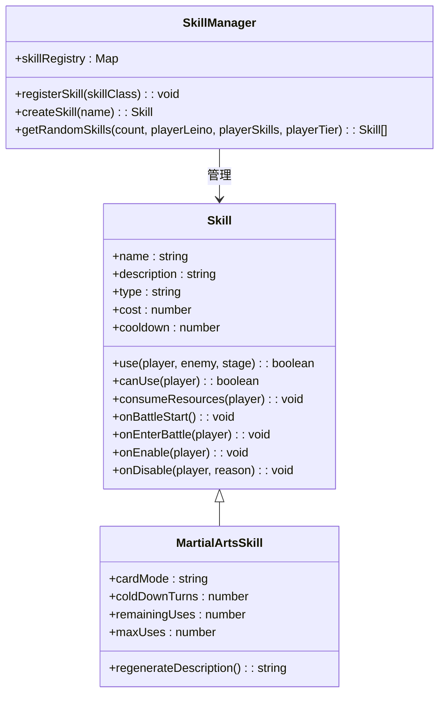
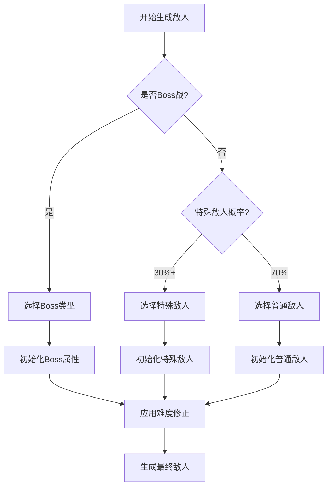

# rtvl_test 项目概述

<cite>
**本文档中引用的文件**
- [README.md](file://README.md)
- [package.json](file://package.json)
- [src/main.js](file://src/main.js)
- [src/App.vue](file://src/App.vue)
- [src/GameApp.vue](file://src/GameApp.vue)
- [src/data/gameState.js](file://src/data/gameState.js)
- [src/data/battle.js](file://src/data/battle.js)
- [src/data/player.js](file://src/data/player.js)
- [src/backendEventBus.js](file://src/backendEventBus.js)
- [src/frontendEventBus.js](file://src/frontendEventBus.js)
- [src/data/skillManager.js](file://src/data/skillManager.js)
- [src/data/enemyFactory.js](file://src/data/enemyFactory.js)
- [src/data/abilityManager.js](file://src/data/abilityManager.js)
</cite>

## 目录
1. [项目简介](#项目简介)
2. [技术架构概览](#技术架构概览)
3. [核心设计理念](#核心设计理念)
4. [游戏流程架构](#游戏流程架构)
5. [技术选型详解](#技术选型详解)
6. [系统组件分析](#系统组件分析)
7. [状态管理系统](#状态管理系统)
8. [游戏机制实现](#游戏机制实现)
9. [开发指南](#开发指南)
10. [总结](#总结)

## 项目简介

rtvl_test 是一个基于 Vue 3 的回合制卡牌战斗游戏，采用现代化的前端技术栈构建。该项目是一个单人肉鸽（Roguelike）文字冒险型网页小游戏，玩家将扮演一名灵御（能够使用魏启这种神奇能量的战士），在尖塔中不断攀登，击败越来越强大的敌人，收集资源，提升能力，最终挑战终极Boss。

### 游戏核心特色

- **回合制战斗系统**：基于行动点数的策略战斗，强调技能组合和战术运用
- **丰富的技能体系**：包含多种类型的技能，支持技能升级和组合
- **动态敌人生成**：根据战斗场次动态调整敌人强度和类型
- **能力成长系统**：玩家可以通过战斗获得能力点，解锁新的能力和效果
- **视觉动画系统**：使用 GSAP 实现流畅的战斗动画和特效

## 技术架构概览



**图表来源**
- [src/main.js](file://src/main.js#L1-L55)
- [src/GameApp.vue](file://src/GameApp.vue#L1-L139)
- [src/data/gameState.js](file://src/data/gameState.js#L1-L75)

## 核心设计理念

### 前后端分离架构

项目采用了创新的前后端分离状态管理模式：

- **显示层状态**：负责渲染和用户交互
- **后端状态**：负责游戏逻辑和结算
- **双状态同步**：通过事件总线实现实时状态同步

### 事件驱动架构



**图表来源**
- [src/backendEventBus.js](file://src/backendEventBus.js#L1-L80)
- [src/frontendEventBus.js](file://src/frontendEventBus.js#L1-L9)

### 组件化设计原则

项目采用高度模块化的组件架构：

- **屏幕级组件**：StartScreen、BattleScreen、RestScreen、EndScreen
- **功能组件**：各种UI控件和特效组件
- **工具组件**：动画控制器、粒子效果管理器等

## 游戏流程架构

### 游戏阶段循环



### 战斗流程详解



**图表来源**
- [src/data/battle.js](file://src/data/battle.js#L1-L553)

## 技术选型详解

### Vue 3 + Vite 技术栈

**Vue 3 选择理由**：
- **Composition API**：提供更好的逻辑复用和代码组织
- **响应式系统优化**：更高效的性能表现
- **TypeScript 支持**：增强的类型安全和开发体验

**Vite 构建工具优势**：
- **快速冷启动**：开发服务器启动速度极快
- **热模块替换**：实时代码更新无需刷新页面
- **ES 模块原生支持**：现代浏览器优化

### GSAP 动画引擎

**使用场景**：
- 战斗技能动画效果
- 卡牌移动和交互动画
- 界面过渡和特效

**技术优势**：
- 高性能动画渲染
- 精确的时间控制
- 丰富的动画缓动函数

### Mitt 事件总线

**前后端分离事件管理**：
- **前端事件总线**：负责动画和UI交互
- **后端事件总线**：负责游戏逻辑和状态管理

**事件分类体系**：
- Game：游戏生命周期事件
- Player：玩家相关事件
- Battle：战斗流程事件
- Rest：休整阶段事件

**图表来源**
- [package.json](file://package.json#L1-L22)
- [src/backendEventBus.js](file://src/backendEventBus.js#L1-L80)

## 系统组件分析

### 核心组件架构



**图表来源**
- [src/GameApp.vue](file://src/GameApp.vue#L1-L139)
- [src/data/player.js](file://src/data/player.js#L1-L226)
- [src/data/skillManager.js](file://src/data/skillManager.js#L1-L253)

### 状态管理组件



**图表来源**
- [src/data/gameState.js](file://src/data/gameState.js#L1-L75)

**章节来源**
- [src/GameApp.vue](file://src/GameApp.vue#L1-L139)
- [src/data/gameState.js](file://src/data/gameState.js#L1-L75)
- [src/data/player.js](file://src/data/player.js#L1-L226)

## 状态管理系统

### 双状态架构设计

项目实现了独特的前后端分离状态管理模式：



**图表来源**
- [src/data/gameState.js](file://src/data/gameState.js#L1-L75)
- [src/backendEventBus.js](file://src/backendEventBus.js#L1-L80)

### 状态同步机制

状态同步通过以下机制实现：

1. **事件驱动同步**：通过事件总线实现实时状态更新
2. **响应式代理**：使用 Vue 3 的响应式系统确保状态变更自动更新
3. **状态验证**：在关键节点验证状态一致性

**章节来源**
- [src/data/gameState.js](file://src/data/gameState.js#L1-L75)
- [src/backendEventBus.js](file://src/backendEventBus.js#L1-L80)

## 游戏机制实现

### 战斗系统核心逻辑



**图表来源**
- [src/data/battle.js](file://src/data/battle.js#L1-L553)

### 技能系统设计

技能系统采用面向对象的设计模式：



**图表来源**
- [src/data/skillManager.js](file://src/data/skillManager.js#L1-L253)

### 敌人生成系统



**图表来源**
- [src/data/enemyFactory.js](file://src/data/enemyFactory.js#L1-L88)

**章节来源**
- [src/data/battle.js](file://src/data/battle.js#L1-L553)
- [src/data/skillManager.js](file://src/data/skillManager.js#L1-L253)
- [src/data/enemyFactory.js](file://src/data/enemyFactory.js#L1-L88)

## 开发指南

### 项目安装和运行

```bash
# 安装依赖
npm install

# 启动开发服务器
npm run dev

# 构建生产版本
npm run build
```

### 项目结构说明

- **src/**: 主要源代码目录
  - **components/**: Vue 组件
  - **data/**: 游戏数据和业务逻辑
  - **utils/**: 工具函数和辅助模块
- **public/**: 静态资源和配置文件

### 技术规范

1. **组件命名**：采用 PascalCase 命名法
2. **样式组织**：使用 CSS Modules 和 BEM 方法论
3. **代码风格**：遵循 Vue 3 Composition API 最佳实践
4. **类型安全**：使用 TypeScript 类型定义

**章节来源**
- [README.md](file://README.md#L1-L60)
- [package.json](file://package.json#L1-L22)

## 总结

rtvl_test 项目展现了现代前端游戏开发的最佳实践，通过 Vue 3 的响应式系统和组件化架构，构建了一个功能完整、性能优异的回合制卡牌战斗游戏。项目的核心优势包括：

### 技术创新点

1. **前后端分离状态管理**：创新的双状态架构确保了游戏逻辑的纯净性和UI的响应性
2. **事件驱动架构**：清晰的事件分类和分发机制提高了系统的可维护性
3. **模块化设计**：高度解耦的组件架构便于功能扩展和团队协作

### 设计哲学

- **用户体验优先**：流畅的动画效果和直观的操作界面
- **可扩展性**：良好的架构设计支持未来功能扩展
- **性能优化**：合理的状态管理和动画优化确保了优秀的游戏体验

### 学习价值

对于游戏开发者而言，该项目提供了：
- 现代前端游戏开发的完整解决方案
- 响应式状态管理的实际应用案例
- 复杂游戏逻辑的模块化设计思路
- 动画系统集成的最佳实践

rtvl_test 不仅仅是一个游戏项目，更是现代前端技术在游戏开发领域应用的优秀范例，为类似项目提供了宝贵的参考价值和技术指导。