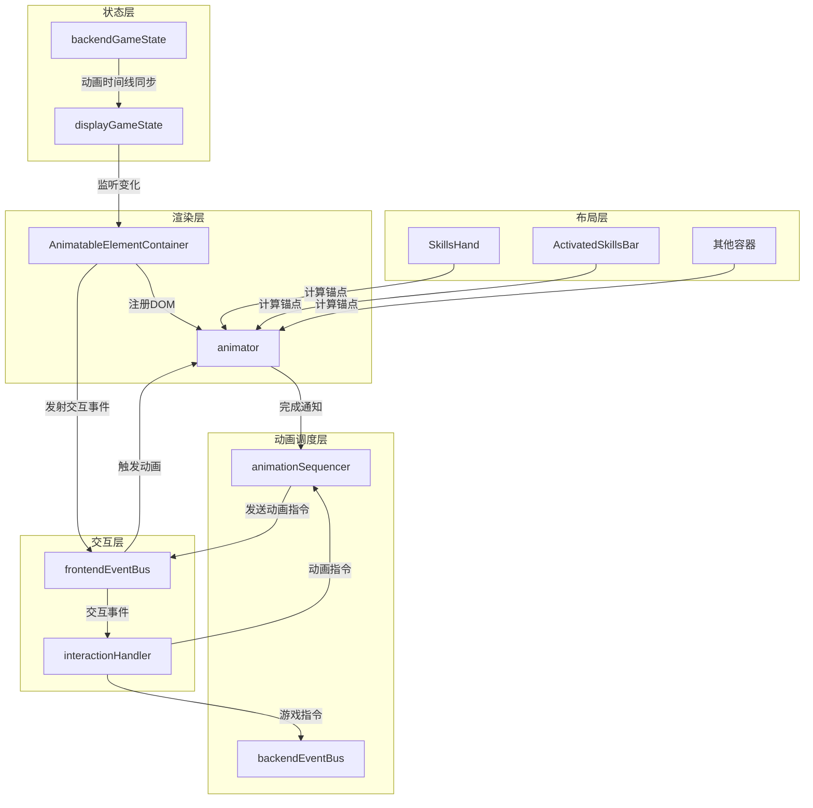
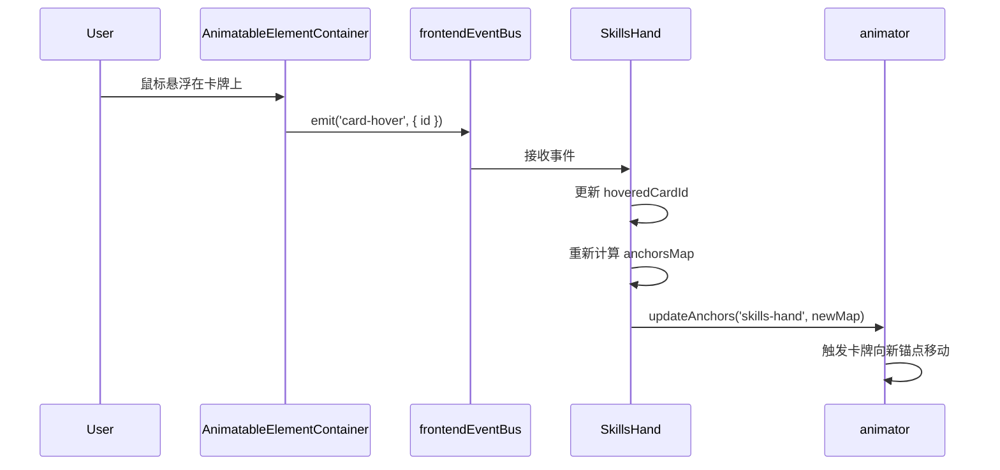

# 前端动画系统重构设计文档

## 重构目标与动机

### 当前系统的问题

当前卡牌动画系统由卡牌容器组件和 `cardAnimationOrchestrator` 共同配合完成，存在以下缺陷：

1. **双轨制复杂性**：卡牌分为"容器中卡牌"和"ghost 卡牌"两种形态，增加了动画实现的复杂度
2. **容器职责过重**：卡牌容器既负责渲染卡牌，又参与动画协调，职责不清晰
3. **动画指令混乱**：后端动画指令充斥着特判和 legacy 兼容代码，复杂度难以接受
4. **扩展性不足**：难以支持高自由度、强交互性的动画需求（拖拽、多卡协同、卡牌与面板交互等）
5. **元素类型局限**：仅支持卡牌动画，无法将面板等其他 UI 元素纳入统一动画框架

### 重构目标

1. **统一动画元素**：移除容器卡牌与 ghost 卡牌的区别，所有可动画元素统一管理
2. **职责分离**：明确容器、animator、渲染器的职责边界
3. **扩展性**：支持卡牌、玩家面板、敌人面板等多种元素的统一动画框架
4. **简化指令**：抽象化动画指令格式，移除 legacy 代码
5. **增强交互**：为复杂交互动画（拖拽、碰撞、击退等）预留控制能力

## 新架构概览

### 核心组件职责

#### Animator（动画编排器）

- **唯一职责**：管理所有可动画元素的 DOM 位置、缩放、旋转、透明度等 CSS 属性
- **核心功能**：
  - 维护 `id -> DOM` 注册表（取代 `cardDomRegistry`）
  - 提供适配器机制（卡牌适配器、单位面板适配器）
  - 接收来自 `animationSequencer` 的动画指令并执行
  - 管理锚点信息，实现元素向锚点"静息归位"
  - 动画完成后通知 `animationSequencer`

#### AnimatableElementContainer（可动画元素容器）

- **唯一职责**：渲染和维护所有可动画元素的 DOM 生命周期
- **核心功能**：
  - 监听 `displayGameState` 的变化，渲染所有在场可动画元素
  - 将 DOM 元素注册到 `animator`
  - 绑定基础交互事件（拖拽、悬浮、点击）
  - 将交互事件发送到前端事件总线（携带元素 ID）
  - 根据元素状态控制可见性（隐藏牌库中、已焚毁的卡牌）

#### 布局逻辑容器（SkillsHand、ActivatedSkillsBar 等）

- **职责转变**：从"渲染器 + 交互处理器"变为"锚点计算器"
- **核心功能**：
  - **不再渲染** `SkillCard` 组件
  - 计算所属卡牌的"锚点"位置（静息状态下应处的位置）
  - 通过 API 将锚点信息告知 `animator`（如 `animator.updateAnchors(containerKey, anchorsMap)`）
  - 处理布局相关的计算逻辑（悬浮展开、拖拽插槽位置等）

#### 交互事件处理模块（interactionHandler.js）

- **唯一职责**：将基础交互事件转换为动画指令和后端指令
- **核心功能**：
  - 监听来自 `AnimatableElementContainer` 的交互事件（`card-drag-start`、`card-hover` 等）
  - 将拖拽操作转换为动画指令（发送到 `animationSequencer`，使用低阻塞 `waitTags`）
  - 将用户操作（如打出卡牌）转换为后端指令（发送到 `backendEventBus`）
  - **不直接**操作 animator 或 DOM

### 数据流设计



### 关键设计决策

1. **所有卡牌都渲染**：`AnimatableElementContainer` 渲染 `displayGameState.player.skills` 中的所有卡牌（包括牌库、已焚毁），通过 CSS 隐藏不在牌桌上的卡牌
2. **锚点通过 API 传递**：布局容器通过 `animator.updateAnchors(containerKey, anchorsMap)` 方法主动告知 animator
3. **拖拽走 animationSequencer**：拖拽等实时交互也通过 `animationSequencer` 排队，但使用低阻塞时间线（`waitTags: ['dragBlocker']`），保证实时响应
4. **移除内部队列**：animator 不再维护每张卡的串行队列（`_idChains`），所有排队逻辑统一由 `animationSequencer` 管理
5. **移除 steps 机制**：不再支持单条指令携带多步骤动画，改为发送多条独立指令，通过 `tags/waitTags` 串联

## Animator 设计

### 核心职责

Animator 是新动画系统的核心执行器，负责：

1. 管理可动画元素的 DOM 注册表
2. 执行来自 `animationSequencer` 的动画指令
3. 管理锚点信息，实现元素向锚点的"静息归位"
4. 提供适配器机制，支持不同类型元素的动画

### 核心 API 设计

#### 初始化

```
animator.init(options)
```

参数：
- `overlayEl`: 动画覆盖层的 DOM 元素
- `centerAnchorEl`: 中心舞台锚点元素
- `deckAnchorEl`: 牌库锚点元素
- 其他全局锚点...

#### DOM 注册表管理

```
animator.register(id, element, adapterType)
```

- 注册一个可动画元素
- `id`: 元素唯一标识（如卡牌的 `uniqueID`）
- `element`: DOM 元素
- `adapterType`: 适配器类型（`'card'` | `'unit-panel'`）

```
animator.unregister(id)
```

- 解除注册

```
animator.getElement(id)
```

- 获取已注册的 DOM 元素

#### 锚点管理

```
animator.updateAnchors(containerKey, anchorsMap)
```

- 更新某个容器的锚点信息
- `containerKey`: 容器标识（如 `'skills-hand'`、`'activated-skills'`）
- `anchorsMap`: `Map<id, { x, y, scale?, rotation? }>`，元素 ID 到锚点坐标的映射

```
animator.setGlobalAnchor(name, position)
```

- 设置全局锚点（如 `'center'`、`'deck'`）
- `position`: `{ x, y }`

#### 动画执行

```
animator.animate(payload)
```

- 执行单次动画
- `payload` 结构：
  - `id`: 元素 ID
  - `to`: 目标属性 `{ x?, y?, scale?, rotate?, opacity? }`
  - `duration`: 持续时间（毫秒）
  - `ease`: 缓动函数
  - `anchor?`: 目标锚点名称（如果提供，则 `to.x/y` 从锚点计算）
  - `completionToken`: 完成回调标识

```
animator.animateToAnchor(id, anchorName, options)
```

- 快捷方法：将元素动画到指定锚点

```
animator.returnToRest(id, duration)
```

- 将元素缓缓归位到其锚点（静息状态）

### 适配器机制

#### 适配器接口

每种可动画元素类型有独立的适配器，负责处理特定于该类型的动画逻辑。

```
适配器接口：
{
  getDefaultProps(element): 获取元素的默认属性（如卡牌的默认尺寸）
  beforeAnimate(element, animationPayload): 动画前的预处理
  afterAnimate(element, animationPayload): 动画后的清理
  getRestPosition(id): 获取元素的静息位置（锚点）
}
```

#### 卡牌适配器

- 处理卡牌特有的动画效果（如焚毁粒子效果）
- 管理卡牌的可见性（根据 `frontierSkills`、`activatedSkills` 状态）
- 提供卡牌的默认尺寸信息

#### 单位面板适配器

- 处理面板的震动、击退动画
- 管理面板的受伤闪烁效果（可能与 `HurtAnimationWrapper` 协作）
- 提供面板的默认位置信息

### 静息归位机制

Animator 维护一个 `requestAnimationFrame` 循环（可选，按需启用）：

- 对于没有正在播放动画的元素，缓缓向其锚点位置靠拢
- 使用较慢的缓动（如 `power1.out`），避免与指令动画冲突
- 当元素接近锚点时停止归位动画

触发条件：
- 动画指令执行完毕
- 锚点位置发生变化（如容器重新计算布局）

### 与 animationSequencer 的协作

Animator 监听前端事件总线上的动画事件：

```
frontendEventBus.on('animate-element', (payload) => {
  animator.animate(payload);
  // 完成后发送通知
  frontendEventBus.emit('animation-instruction-finished', { 
    id: payload.instructionId 
  });
});
```

关键点：
- Animator 是**无状态执行器**，不维护队列
- 所有排队、依赖管理由 `animationSequencer` 负责
- 每个动画指令携带 `instructionId`（由 sequencer 生成），用于完成通知

## AnimatableElementContainer 设计

### 核心职责

`AnimatableElementContainer` 是一个全局 Vue 组件，负责渲染所有可动画元素的 DOM 并管理其生命周期。

### 组件结构

```
模板结构：
<div class="animatable-elements-container">
  <!-- 卡牌层 -->
  <div class="cards-layer">
    <SkillCard
      v-for="skill in allSkills"
      :key="skill.uniqueID"
      :skill="skill"
      :player="player"
      :class="{ hidden: !isCardVisible(skill) }"
      :ref="el => registerCard(el, skill.uniqueID)"
    />
  </div>
  
  <!-- 单位面板层（可选，根据需求决定是否在此渲染） -->
  <div class="panels-layer">
    <!-- 玩家面板、敌人面板等 -->
  </div>
</div>
```

### 渲染策略

#### 卡牌渲染

- **数据源**：监听 `displayGameState.player.skills`（所有卡牌）
- **可见性判断**：
  - 在 `frontierSkills` 中：可见
  - 在 `activatedSkills` 中：可见
  - 在牌库或已焚毁：隐藏（`visibility: hidden` 或 `opacity: 0`）
- **初始位置**：由 animator 根据锚点计算，组件本身使用绝对定位 `position: absolute`

#### 面板渲染

- 玩家面板、敌人面板可选择：
  - 方案 A：仍在原位置渲染（如 `BattleScreen` 中），通过 `ref` 注册到 animator
  - 方案 B：在 `AnimatableElementContainer` 中统一渲染

建议：**方案 A**，面板作为常驻元素，不需要频繁创建/销毁，仍在原组件中渲染更合理。

### DOM 注册流程

```
生命周期钩子中的注册逻辑：

watch(allSkills, (newSkills, oldSkills) => {
  // 检测新增的卡牌
  const added = newSkills.filter(s => !oldSkills.find(o => o.uniqueID === s.uniqueID));
  
  nextTick(() => {
    added.forEach(skill => {
      const el = cardRefs[skill.uniqueID]?.$el || cardRefs[skill.uniqueID];
      if (el) {
        animator.register(skill.uniqueID, el, 'card');
      }
    });
  });
  
  // 检测移除的卡牌
  const removed = oldSkills.filter(o => !newSkills.find(s => s.uniqueID === o.uniqueID));
  removed.forEach(skill => {
    animator.unregister(skill.uniqueID);
  });
});
```

### 交互事件绑定

在卡牌元素上绑定基础交互事件：

```
模板事件绑定：
<SkillCard
  @mousedown="onCardMouseDown(skill.uniqueID, $event)"
  @mouseenter="onCardHover(skill.uniqueID, $event)"
  @mouseleave="onCardLeave(skill.uniqueID, $event)"
  @click="onCardClick(skill.uniqueID, $event)"
/>

事件处理方法：
onCardMouseDown(id, event) {
  frontendEventBus.emit('card-drag-start', { id, x: event.clientX, y: event.clientY });
}

onCardHover(id, event) {
  frontendEventBus.emit('card-hover', { id });
}

onCardClick(id, event) {
  frontendEventBus.emit('card-click', { id, x: event.clientX, y: event.clientY });
}
```

关键点：
- 事件仅携带元素 ID 和基础坐标信息
- 不包含任何业务逻辑（如是否可用、费用等）
- 业务逻辑由 `interactionHandler` 处理

## 布局容器重构

### 职责转变

原有的卡牌容器（`SkillsHand`、`ActivatedSkillsBar`、`OverlaySkillsPanel`）从"渲染器 + 交互处理器"转变为"锚点计算器"。

### 新的容器结构

#### SkillsHand 示例

```
模板：
<div class="skills-hand-root" ref="handRoot">
  <!-- 不再渲染卡牌，仅作为布局计算的容器 -->
  <!-- 可选：渲染占位符，用于调试锚点位置 -->
</div>

脚本逻辑：
computed: {
  visibleSkillIds() {
    // 从 displayGameState 获取应在手牌的卡牌 ID
    return displayGameState.player.frontierSkills.map(s => s.uniqueID);
  },
  
  anchorsMap() {
    // 计算每张卡的锚点位置
    const map = new Map();
    const layout = this.calculateLayout();
    
    this.visibleSkillIds.forEach((id, index) => {
      map.set(id, {
        x: layout[index].x,
        y: layout[index].y,
        scale: layout[index].scale || 1,
        rotation: layout[index].rotation || 0
      });
    });
    
    return map;
  }
},

watch: {
  anchorsMap: {
    deep: true,
    handler(newMap) {
      // 通知 animator 更新锚点
      animator.updateAnchors('skills-hand', newMap);
    }
  }
},

methods: {
  calculateLayout() {
    // 原有的布局计算逻辑（基于容器宽度、卡牌数量、悬浮状态等）
    // 返回 [{ x, y, scale, rotation }, ...]
  }
}
```

### 悬浮与拖拽的布局影响

容器仍然负责计算悬浮、拖拽等状态对布局的影响：

- **悬浮**：监听 `card-hover` 事件，更新内部状态 `hoveredCardId`，重新计算锚点（悬浮卡周围的卡牌锚点偏移）
- **拖拽插槽**：监听 `card-drag-move` 事件，计算插槽位置，更新其他卡牌的锚点

关键点：
- 容器**不直接控制** DOM 位置
- 容器通过更新锚点**间接影响**布局
- 实际的 DOM 动画由 animator 执行

### 容器与 animator 的交互时序



## 交互事件处理设计

### interactionHandler 模块结构

`interactionHandler.js` 是一个独立的 JavaScript 模块，在应用启动时初始化。

### 核心职责

1. 监听来自 `AnimatableElementContainer` 的基础交互事件
2. 结合游戏状态（`displayGameState`）判断交互的有效性
3. 将有效交互转换为动画指令和/或后端指令
4. 发送指令到相应的总线

### 拖拽流程设计

#### 拖拽开始

```
监听事件：
frontendEventBus.on('card-drag-start', ({ id, x, y }) => {
  // 检查是否允许拖拽（如在休整阶段）
  if (!isDraggable()) return;
  
  // 记录拖拽状态
  draggingCardId = id;
  dragStartPos = { x, y };
  
  // 发送动画指令：提升卡牌（缩放、z-index）
  animationSequencer.enqueueInstruction({
    tags: ['drag', `drag-${id}`],
    waitTags: ['dragBlocker'], // 低阻塞，几乎不等待
    durationMs: 0,
    start: ({ emit }) => {
      emit('animate-element', {
        id,
        to: { scale: 1.1, zIndex: 9999 },
        duration: 100,
        ease: 'power1.out'
      });
    }
  });
  
  // 绑定全局鼠标移动监听
  window.addEventListener('mousemove', onDragMove);
  window.addEventListener('mouseup', onDragEnd);
});
```

#### 拖拽移动

```
function onDragMove(event) {
  const dx = event.clientX - dragStartPos.x;
  const dy = event.clientY - dragStartPos.y;
  
  // 发送动画指令：实时更新位置
  animationSequencer.enqueueInstruction({
    tags: ['drag-move', `drag-${draggingCardId}`],
    waitTags: ['dragBlocker'],
    durationMs: 0,
    start: ({ emit }) => {
      emit('animate-element', {
        id: draggingCardId,
        to: { 
          x: originalPos.x + dx, 
          y: originalPos.y + dy 
        },
        duration: 0 // 即时响应
      });
    }
  });
  
  // 通知容器计算插槽位置
  frontendEventBus.emit('card-drag-move', { 
    id: draggingCardId, 
    x: event.clientX, 
    y: event.clientY 
  });
}
```

#### 拖拽结束

```
function onDragEnd(event) {
  window.removeEventListener('mousemove', onDragMove);
  window.removeEventListener('mouseup', onDragEnd);
  
  // 判断拖拽目标（如是否打出卡牌）
  const target = determineDropTarget(event.clientX, event.clientY);
  
  if (target === 'play-area') {
    // 向后端发送打出卡牌指令
    backendEventBus.emit('PLAYER_USE_SKILL', draggingCardId);
    
    // 动画指令由后端在结算后发送
    
  } else if (target === 'reorder') {
    // 重排序（如 PreparationPanel 中）
    const insertIndex = calculateInsertIndex(event.clientX);
    backendEventBus.emit('REORDER_SKILL', { 
      skillId: draggingCardId, 
      newIndex: insertIndex 
    });
    
  } else {
    // 无效拖拽，飞回原位
    animationSequencer.enqueueInstruction({
      tags: ['drag-return'],
      waitTags: ['dragBlocker'],
      durationMs: 300,
      start: ({ emit }) => {
        emit('animate-element-to-anchor', {
          id: draggingCardId,
          duration: 300,
          ease: 'power2.out'
        });
      }
    });
  }
  
  draggingCardId = null;
}
```

### 悬浮处理

```
frontendEventBus.on('card-hover', ({ id }) => {
  // 通知容器更新布局（容器会重新计算锚点）
  // 容器的 watch 会自动调用 animator.updateAnchors
  
  // 可选：发送动画指令，如显示提示框
  frontendEventBus.emit('show-card-tooltip', { id });
});

frontendEventBus.on('card-leave', ({ id }) => {
  frontendEventBus.emit('hide-card-tooltip', { id });
});
```

### 点击处理

```
frontendEventBus.on('card-click', ({ id, x, y }) => {
  // 检查是否可用
  const skill = displayGameState.player.frontierSkills.find(s => s.uniqueID === id);
  if (!skill || !canUseSkill(skill)) return;
  
  // 发送后端指令
  backendEventBus.emit('PLAYER_USE_SKILL', id);
  
  // 生成粒子效果（可选）
  spawnParticlesAtPosition(x, y, skill.manaCost, skill.actionPointCost);
});
```

### 与低阻塞时间线的配合

关键点：

- 拖拽相关的动画使用 `waitTags: ['dragBlocker']`
- 默认情况下，没有任何指令携带 `tags: ['dragBlocker']`，因此拖拽动画几乎不等待
- 特殊场景下可以携带 `tags: ['dragBlocker']`，此时会阻塞拖拽操作
- 保证了实时性与控制能力的平衡

## 动画指令格式设计

### 移除 steps 机制

旧格式（已废弃）：

```
{
  id: 123,
  kind: 'centerThenDeck',
  steps: [
    { toAnchor: 'center', scale: 1.2, duration: 300, holdMs: 350 },
    { toAnchor: 'deck', scale: 0.5, duration: 400 }
  ]
}
```

新格式（推荐）：

```
// 第一步：飞到中心
enqueueInstruction({
  tags: ['card-anim', 'card-123-seq-1'],
  waitTags: ['all'],
  durationMs: 300,
  start: ({ emit }) => {
    emit('animate-element', {
      id: 123,
      anchor: 'center',
      to: { scale: 1.2 },
      duration: 300
    });
  }
});

// 停顿
enqueueDelay(350, { waitTags: ['card-123-seq-1'] });

// 第二步：飞回牌库
enqueueInstruction({
  tags: ['card-anim', 'card-123-seq-2'],
  waitTags: ['card-123-seq-1'],
  durationMs: 400,
  start: ({ emit }) => {
    emit('animate-element', {
      id: 123,
      anchor: 'deck',
      to: { scale: 0.5, rotate: 20 },
      duration: 400
    });
  }
});
```

### 自动生成 tags 的 Helper

为简化使用，提供辅助函数：

```
辅助函数设计：
function enqueueCardAnimation(id, animPayload, options = {}) {
  const autoTag = `card-${id}-${Date.now()}-${Math.random().toString(36).slice(2)}`;
  
  return animationSequencer.enqueueInstruction({
    tags: ['card-anim', autoTag, ...(options.tags || [])],
    waitTags: options.waitTags || ['all'],
    durationMs: animPayload.duration || 0,
    start: ({ emit }) => {
      emit('animate-element', {
        id,
        ...animPayload
      });
    }
  });
}

使用示例：
const tag1 = enqueueCardAnimation(123, { 
  anchor: 'center', 
  to: { scale: 1.2 }, 
  duration: 300 
});

enqueueDelay(350, { waitTags: [tag1] });

enqueueCardAnimation(123, { 
  anchor: 'deck', 
  to: { scale: 0.5 }, 
  duration: 400 
}, { waitTags: [tag1] });
```

### 常用动画指令封装

#### 卡牌出现

```
function enqueueCardAppear(id, fromAnchor = 'deck', toContainer = 'skills-hand') {
  return enqueueCardAnimation(id, {
    anchor: null, // 不使用锚点，飞向注册位置
    from: { anchor: fromAnchor, scale: 0.6, opacity: 0 },
    to: { scale: 1, opacity: 1 },
    duration: 300,
    ease: 'power2.out'
  }, {
    tags: ['card-appear']
  });
}
```

#### 卡牌焚毁

```
function enqueueCardBurn(id) {
  const tag1 = enqueueCardAnimation(id, {
    to: { scale: 1.15 },
    duration: 350,
    particleEmit: { /* 粒子配置 */ }
  }, { tags: ['card-burn'] });
  
  return enqueueCardAnimation(id, {
    to: { opacity: 0, rotate: 0 },
    duration: 500,
    particleEmit: { /* 粒子配置 */ }
  }, { 
    waitTags: [tag1],
    tags: ['card-burn']
  });
}
```

#### 卡牌飞向中心展示后回牌库

```
function enqueueCardCenterThenDeck(id, holdMs = 350) {
  const tag1 = enqueueCardAnimation(id, {
    anchor: 'center',
    to: { scale: 1.2 },
    duration: 350
  });
  
  const tag2 = enqueueDelay(holdMs, { waitTags: [tag1] });
  
  return enqueueCardAnimation(id, {
    anchor: 'deck',
    to: { scale: 0.5, rotate: 20 },
    duration: 550
  }, { waitTags: [tag2] });
}
```

### 面板动画指令

#### 面板受伤震动

```
function enqueuePanelHurt(panelId, damage) {
  const duration = Math.min(200 + damage * 2, 600);
  
  return enqueueInstruction({
    tags: ['panel-anim', 'panel-hurt'],
    waitTags: ['all'],
    durationMs: duration,
    start: ({ emit }) => {
      emit('animate-element', {
        id: panelId,
        effect: 'shake', // 特殊效果标识
        intensity: Math.min(damage / 10, 5),
        duration
      });
    }
  });
}
```

#### 面板击退

```
function enqueuePanelKnockback(panelId, direction, distance) {
  const tag1 = enqueueInstruction({
    tags: ['panel-knockback'],
    waitTags: ['all'],
    durationMs: 200,
    start: ({ emit }) => {
      emit('animate-element', {
        id: panelId,
        to: { 
          x: `+=${direction === 'left' ? -distance : distance}`,
          y: 0
        },
        duration: 200,
        ease: 'power2.out'
      });
    }
  });
  
  // 回弹
  return enqueueInstruction({
    tags: ['panel-knockback-return'],
    waitTags: [tag1],
    durationMs: 300,
    start: ({ emit }) => {
      emit('animate-element-to-anchor', {
        id: panelId,
        duration: 300,
        ease: 'elastic.out(1, 0.5)'
      });
    }
  });
}
```

## 迁移计划

### 第一阶段：核心基础设施

#### 新增文件

| 文件路径 | 说明 |
|---------|------|
| `src/utils/animator.js` | 新的动画编排器（取代 `cardAnimationOrchestrator.js`） |
| `src/components/global/AnimatableElementContainer.vue` | 可动画元素渲染容器 |
| `src/utils/interactionHandler.js` | 交互事件处理模块 |
| `src/utils/animationHelpers.js` | 动画指令封装辅助函数 |

#### 修改文件

| 文件路径 | 修改内容 |
|---------|---------|
| `src/data/animationSequencer.js` | 无需修改，保持现有设计 |
| `src/frontendEventBus.js` | 添加新的事件类型文档注释 |

#### 删除文件

| 文件路径 | 原因 |
|---------|------|
| `src/utils/cardAnimationOrchestrator.js` | 由 `animator.js` 取代 |
| `src/utils/cardDomRegistry.js` | 功能合并到 `animator.js` |

### 第二阶段：容器重构

#### 修改文件

| 文件路径 | 修改内容 |
|---------|---------|
| `src/components/battle/SkillsHand.vue` | 移除渲染逻辑，保留锚点计算 |
| `src/components/battle/ActivatedSkillsBar.vue` | 移除渲染逻辑，保留锚点计算 |
| `src/components/battle/OverlaySkillsPanel.vue` | 移除渲染逻辑，保留锚点计算 |

#### 关键步骤

1. 提取现有的布局计算逻辑（`calculateLayout` 方法）
2. 移除 `<SkillCard>` 组件的渲染
3. 添加 `anchorsMap` 计算属性
4. 添加 `watch(anchorsMap)` 调用 `animator.updateAnchors`
5. 移除交互事件处理（由 `interactionHandler` 接管）

### 第三阶段：动画指令更新

#### 修改文件

| 文件路径 | 修改内容 |
|---------|---------|
| `src/data/animationInstructionHelpers.js` | 更新动画指令封装函数，移除 `steps` 相关代码 |
| `src/data/battleInstructionHelpers.js` | 更新战斗指令中的动画调用 |

#### 关键步骤

1. 将所有使用 `enqueueAnimateCardById({ steps: [...] })` 的代码改为多次调用
2. 使用 `animationHelpers.js` 中的封装函数简化代码
3. 确保 `waitTags` 正确设置，保证动画顺序

### 第四阶段：面板集成

#### 修改文件

| 文件路径 | 修改内容 |
|---------|---------|
| `src/components/global/PlayerStatusPanel.vue` | 注册到 animator |
| `src/components/battle/EnemyStatusPanel.vue` | 注册到 animator |
| `src/components/global/HurtAnimationWrapper.vue` | 与 animator 的受伤动画协作 |

#### 关键步骤

1. 在 `mounted` 钩子中调用 `animator.register(panelId, this.$el, 'unit-panel')`
2. 移除内部的位置动画逻辑（如震动），改为接收 animator 的动画
3. 保留内部的视觉效果（如闪烁、颜色变化）

### 第五阶段：测试与优化

#### 测试检查清单

- [ ] 卡牌从牌库抽取到手牌的动画正常
- [ ] 手牌悬浮展开效果正常
- [ ] 卡牌拖拽重排序正常（休整阶段）
- [ ] 卡牌拖拽打出正常（战斗阶段）
- [ ] 卡牌焚毁动画正常
- [ ] 卡牌飞向中心展示动画正常
- [ ] 激活技能栏的卡牌动画正常
- [ ] 玩家面板受伤震动正常
- [ ] 敌人面板受伤震动正常
- [ ] 多个动画的时间线依赖正常（如连续打出多张卡）

## 技术细节补充

### CSS 架构

#### AnimatableElementContainer 的样式

```
样式设计要点：
.animatable-elements-container {
  position: fixed;
  inset: 0;
  pointer-events: none; /* 容器本身不接收事件 */
  z-index: var(--z-animatable-elements);
}

.cards-layer,
.panels-layer {
  position: absolute;
  inset: 0;
}

.cards-layer > * {
  position: absolute; /* 所有卡牌使用绝对定位 */
  pointer-events: auto; /* 卡牌本身接收事件 */
  transform-origin: center center;
  will-change: transform, opacity;
}

.cards-layer > .hidden {
  visibility: hidden; /* 隐藏不在场的卡牌 */
}
```

#### Animator 的 CSS 控制

Animator 通过 GSAP 直接修改元素的 `transform` 和其他 CSS 属性：

```
关键属性：
- transform: translate(x, y) scale(s) rotate(deg)
- opacity
- z-index（通过 style 直接设置）
- visibility（初始状态由 AnimatableElementContainer 控制）
```

### 性能优化

#### 注册表优化

```
注册表结构：
{
  id: {
    element: DOM元素,
    adapter: 适配器实例,
    anchor: { x, y, scale, rotation } | null,
    currentAnimation: GSAP Tween | null
  }
}

优化要点：
- 使用 Map 而非普通对象（O(1) 查找）
- 及时清理已销毁元素的注册
- 使用 WeakMap 存储 DOM -> ID 的反向映射（自动垃圾回收）
```

#### 动画优化

```
GSAP 优化配置：
gsap.to(element, {
  x, y, scale, rotation, opacity,
  duration,
  ease,
  force3D: true, // 强制 GPU 加速
  lazy: false, // 禁用延迟渲染（确保精确时序）
  overwrite: 'auto' // 自动覆盖冲突的动画
});
```

#### 事件节流

对于高频事件（如 `card-drag-move`），使用节流：

```
节流策略：
let lastDragUpdate = 0;
const DRAG_THROTTLE_MS = 16; // ~60fps

function onDragMove(event) {
  const now = Date.now();
  if (now - lastDragUpdate < DRAG_THROTTLE_MS) return;
  lastDragUpdate = now;
  
  // 处理拖拽...
}
```

### 边界情况处理

#### 动画冲突

场景：元素正在播放动画 A 时，收到动画 B 指令。

处理：
- GSAP 的 `overwrite: 'auto'` 会自动中断冲突的属性
- Animator 在开始新动画前调用 `gsap.killTweensOf(element)` 清理旧动画
- AnimationSequencer 通过 `waitTags` 避免指令级冲突

#### 元素未注册

场景：收到动画指令，但元素尚未注册（如卡牌 DOM 未渲染）。

处理：
- Animator 检查注册表，元素不存在时跳过动画并立即发送完成通知
- 日志警告，便于调试

#### 锚点缺失

场景：元素已注册，但其锚点未设置（如容器未更新锚点）。

处理：
- Animator 提供默认锚点（屏幕中心）
- 日志警告，提示容器未正确更新锚点

#### 快速状态切换

场景：用户快速切换场景（如从战斗到休整），大量卡牌需要快速隐藏/显示。

处理：
- AnimatableElementContainer 的 `watch` 使用 `flush: 'post'`（在 DOM 更新后执行）
- 批量注册/解除注册，减少重绘
- 可选：使用 `requestIdleCallback` 延迟非关键动画

## 扩展性考虑

### 未来可能的扩展

#### 粒子系统集成

目前粒子通过前端事件总线发送，可增强为 Animator 内置能力：

```
扩展接口：
animator.attachParticleEmitter(elementId, emitterConfig);

使用示例：
animator.attachParticleEmitter('card-123', {
  trigger: 'burn', // 焚毁时触发
  particles: { color: '#ff6600', count: 50, ... }
});
```

#### 轨迹动画

支持沿贝塞尔曲线等复杂路径的动画：

```
扩展接口：
animator.animateAlongPath(elementId, pathPoints, duration);

使用示例：
animator.animateAlongPath('card-123', [
  { x: 100, y: 100 },
  { x: 200, y: 50, cp1x: 150, cp1y: 30 }, // 控制点
  { x: 300, y: 100 }
], 1000);
```

#### 动画预设库

为常见动画提供预设，简化调用：

```
预设示例：
animationPresets.cardShuffle(cardIds, duration);
animationPresets.explosionEffect(centerPos, intensity);
animationPresets.heroEntrance(panelId);
```

### 适配器扩展

未来可能的适配器类型：

| 适配器类型 | 用途 | 特殊处理 |
|-----------|------|---------|
| `card` | 卡牌 | 焚毁粒子、翻转动画 |
| `unit-panel` | 单位面板 | 震动、击退、闪烁 |
| `item` | 道具图标 | 获得时的飞入动画 |
| `particle-group` | 粒子组 | 批量粒子的统一控制 |
| `background` | 背景元素 | 视差滚动效果 |

每个适配器实现统一接口，Animator 根据 `adapterType` 加载对应适配器。

## 风险评估与缓解

### 主要风险

#### 时序复杂性

**风险**：复杂的动画依赖关系可能导致时序错误。

**缓解**：
- 充分利用 animationSequencer 的 `tags/waitTags` 机制
- 提供可视化调试工具，展示动画时间线
- 编写单元测试，验证关键动画序列

#### 状态同步

**风险**：动画状态与游戏状态不一致（如卡牌已焚毁但仍显示）。

**缓解**：
- AnimatableElementContainer 严格监听 `displayGameState`
- 动画完成后确保调用适配器的 `afterAnimate` 清理
- 提供 `animator.reset()` 方法，紧急情况下强制同步状态

### 重构原则

1. **优先代码质量**：新框架的代码质量和可维护性优先于与旧效果的完全一致性
2. **不追求完全一致**：由于动画框架的根本性变化，某些旧效果的实现方式可能不再适用，可以重新设计以适应新框架
3. **关注核心体验**：保证核心动画流程（如卡牌打出、焚毁）的流畅性，非核心细节可以调整
4. **无需兼容**：移除旧代码仓库中糟糕的部分，无需后向兼容。

## 开发建议

### 开发顺序

1. **先实现 Animator 的核心功能**（注册表、基础动画执行）
2. **实现 AnimatableElementContainer**（仅渲染卡牌，暂不处理交互）
3. **重构一个简单容器**（如 `ActivatedSkillsBar`），验证锚点机制
4. **实现 interactionHandler 的基础功能**（如卡牌点击）
5. **逐步迁移其他容器和动画指令**
6. **最后集成面板动画**

### 代码风格建议

#### 命名约定

- Animator 方法：`camelCase`（如 `updateAnchors`）
- 事件名称：`kebab-case`（如 `card-drag-start`）
- 适配器类型：`kebab-case`（如 `'unit-panel'`）
- 标签（tags）：`kebab-case`（如 `'card-animation'`、`'drag-blocker'`）

#### 注释规范

```
关键函数注释示例：
/**
 * 更新指定容器的锚点信息
 * @param {string} containerKey - 容器标识（如 'skills-hand'）
 * @param {Map<string|number, AnchorInfo>} anchorsMap - 元素ID到锚点的映射
 * @description
 * 当容器的布局发生变化时调用此方法。Animator 会触发元素向新锚点的缓动动画。
 * 如果元素正在播放其他动画，静息归位动画会在动画结束后自动触发。
 */
animator.updateAnchors(containerKey, anchorsMap)
```